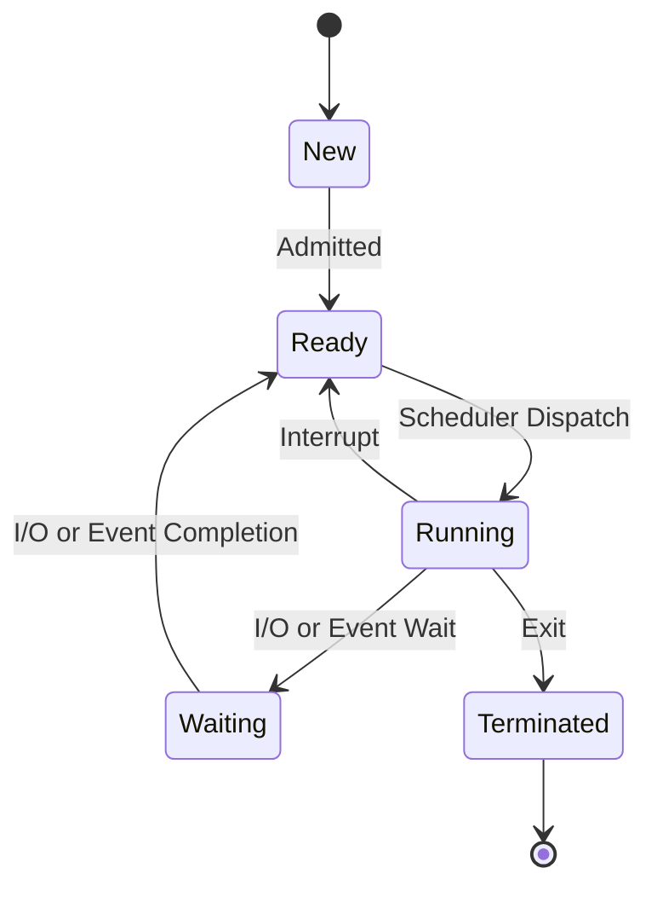
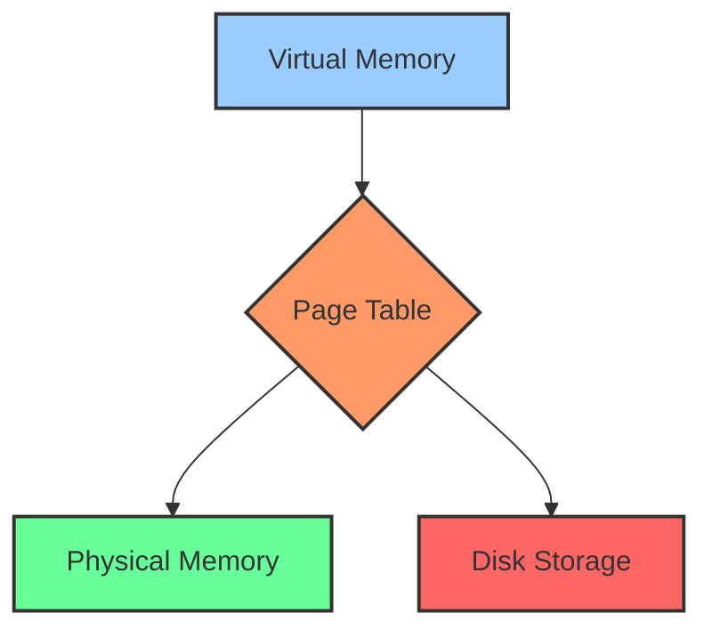
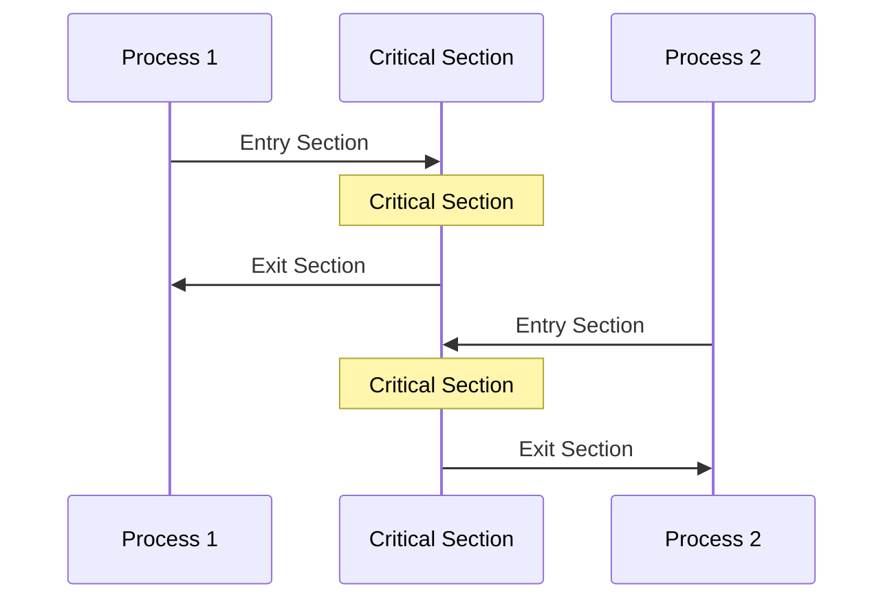
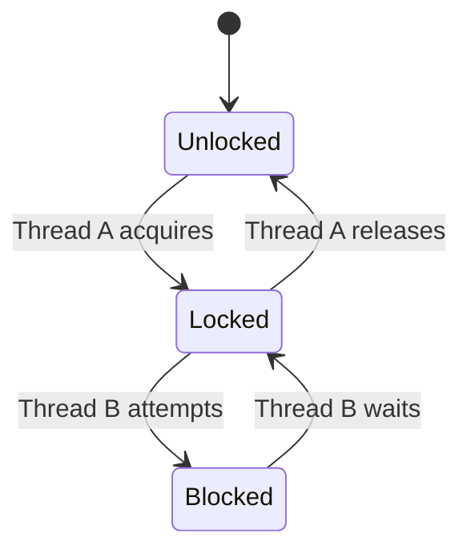
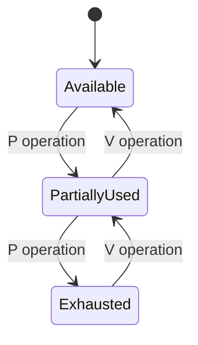
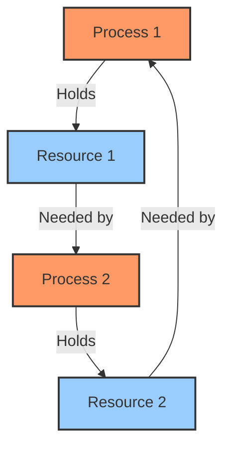
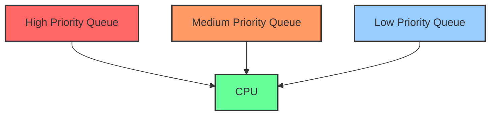
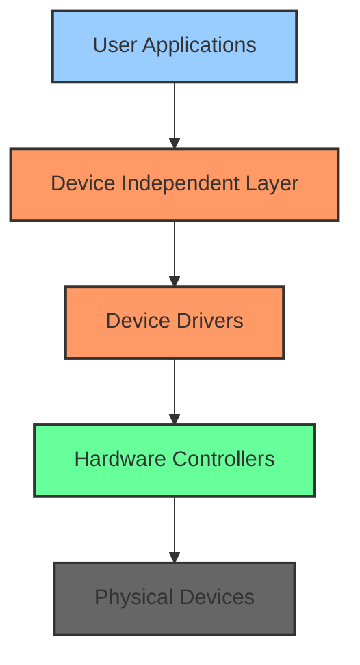

# Operating Systems Fundamentals

## Understanding Operating System Diagrams

### Process State Transitions


The process state transition diagram illustrates the complete lifecycle of a process within an operating system. When a process is first created, it enters the New state where the operating system allocates memory and initializes the Process Control Block (PCB). This initialization phase involves setting up essential data structures and performing admission control to ensure system resources can accommodate the new process.

Once initialization is complete, the process moves to the Ready state, where it is loaded into memory and awaits CPU time. In this state, the process has all required resources except for the CPU itself. Multiple processes can exist in the ready state simultaneously, managed by the system's ready queue.

When the CPU scheduler selects a process, it transitions to the Running state. This is a critical state where the CPU actively executes the process instructions. Due to the nature of modern operating systems, only one process per CPU core can be in the running state at any given time. The process may use its allocated CPU time quantum and can make I/O or system calls during execution.

During execution, a process may need to wait for an external event or I/O operation, causing it to enter the Waiting state. In this state, the process cannot use the CPU and must wait for the completion of its requested operation. Common scenarios include waiting for disk I/O, network packets, or user input.

Finally, when a process completes its execution or is terminated by the system, it enters the Terminated state. During this phase, the operating system performs cleanup operations, releasing allocated resources and removing the PCB. This ensures proper system resource management and prevents memory leaks.

Consider a real-world example of a video encoding program: When launched, it begins in the New state as the system sets up its environment. It moves to Ready when prepared to process video frames. While actively encoding frames, it's in the Running state. When reading the next video chunk from disk, it enters the Waiting state. This cycle continues until encoding completes, at which point it enters the Terminated state.

### Memory Management System


Virtual memory represents one of the most significant innovations in operating system design, providing an abstraction that separates the programmer's view of memory from the physical hardware implementation. Each process operates within its own virtual address space, ranging from zero to the maximum allowed size, creating an illusion of having exclusive access to the entire memory space. In reality, this memory is fragmented across physical memory and disk storage.

At the heart of virtual memory management lies the page table, a crucial data structure that maintains the mapping between virtual pages and physical memory frames. Each page table entry (PTE) contains essential information: the frame number where the page resides, a present/absent bit indicating if the page is in physical memory, a modified bit tracking changes, a referenced bit for access patterns, and protection bits controlling access permissions.

Physical memory, or RAM, represents the actual hardware memory available to the system. It's divided into fixed-size frames and shared among all processes. The Memory Management Unit (MMU) actively manages these frames, handling the translation from virtual to physical addresses and enforcing access permissions.

When physical memory becomes full, the system utilizes disk storage as an extension of RAM through a process called paging. While significantly slower than RAM, disk storage provides the necessary space for less frequently accessed pages, enabling the system to maintain the illusion of larger memory space than physically available.

The interaction between these components manifests in two key operations: page hits and page faults. A page hit occurs when a virtual address is successfully translated to a physical address through the page table, handled efficiently by the MMU without disk access. A page fault happens when the requested page isn't in physical memory, requiring the operating system to load it from disk while the process waits. This may involve evicting another page to make room, demonstrating the dynamic nature of memory management.

### 3. Process Synchronization


Process synchronization represents a fundamental concept in operating systems, addressing the challenges of coordinating multiple processes accessing shared resources. The sequence diagram above illustrates the essential components of process synchronization, demonstrating how processes interact with critical sections in a controlled manner.

The entry section serves as a gatekeeper, implementing crucial synchronization mechanisms to ensure safe access to shared resources. When a process attempts to enter a critical section, it must first pass through this entry section, which employs synchronization primitives such as mutexes or semaphores to establish mutual exclusion. This careful control prevents race conditions and maintains data consistency.

The critical section contains code that accesses shared resources, requiring exclusive access to maintain data integrity. Operating systems must ensure that only one process can execute this section at any given time. The length of the critical section significantly impacts system performance, so it's essential to keep these sections as short as possible while still maintaining proper resource protection.

Upon completing its operations in the critical section, a process executes the exit section. This phase involves releasing the synchronization mechanisms and signaling other waiting processes that the critical section is now available. Proper cleanup and signaling in the exit section are crucial for preventing deadlocks and ensuring fair access to resources.

Here's a practical implementation demonstrating these concepts:

```c
// Using a mutex for critical section
mutex_t mutex = MUTEX_INIT;

void process() {
    mutex_lock(&mutex);    // Entry section
    // Critical section
    shared_resource++;     // Access shared resource
    mutex_unlock(&mutex);  // Exit section
}
```

This implementation showcases how synchronization primitives protect shared resources while maintaining system integrity and preventing race conditions. The mutex lock operation in the entry section ensures exclusive access, while the unlock operation in the exit section allows other processes to proceed.

### Synchronization Primitives and Deadlocks

#### Mutex (Mutual Exclusion)


Mutual exclusion (mutex) represents one of the fundamental synchronization primitives in operating systems. A mutex operates as a binary state machine, transitioning between locked and unlocked states to protect critical sections of code. The key characteristic of a mutex is its concept of ownership – only the thread that acquired the mutex can release it, providing a robust mechanism for protecting shared resources.

The state diagram above illustrates the lifecycle of a mutex. When initially created, a mutex starts in an unlocked state. When Thread A requires access to a protected resource, it acquires the mutex, transitioning it to a locked state. If Thread B attempts to acquire the locked mutex, it enters a blocked state, waiting until Thread A releases the mutex. This ownership model prevents priority inversion and provides clear accountability for resource access.

Here's an implementation demonstrating mutex usage:

```c
pthread_mutex_t mutex = PTHREAD_MUTEX_INITIALIZER;

void safe_increment() {
    pthread_mutex_lock(&mutex);
    shared_counter++;  // Critical section
    pthread_mutex_unlock(&mutex);
}
```

#### Semaphore


Semaphores extend beyond the binary nature of mutexes, providing a more flexible synchronization mechanism that maintains a count of available resources. Unlike mutexes, semaphores don't have an ownership concept, making them ideal for producer-consumer scenarios and resource pool management. They support two fundamental operations: P (decrement/wait) and V (increment/signal).

The state diagram demonstrates how a semaphore manages resource allocation. Starting from an available state, P operations gradually consume resources, moving through partially used states until potentially reaching exhaustion. V operations release resources, making them available for waiting processes. This counting mechanism makes semaphores particularly useful for managing multiple instances of a resource.

A practical implementation of a semaphore might look like this:

```c
sem_t semaphore;
sem_init(&semaphore, 0, MAX_RESOURCES);

void use_resource() {
    sem_wait(&semaphore);    // P operation (decrement)
    // Use resource
    sem_post(&semaphore);    // V operation (increment)
}
```

#### Deadlocks


Deadlocks represent a critical challenge in operating systems where processes become permanently blocked while waiting for resources. A deadlock occurs when four necessary conditions converge: mutual exclusion, hold and wait, no preemption, and circular wait. The diagram above illustrates this circular dependency where Process 1 holds Resource 1 while needing Resource 2, and Process 2 holds Resource 2 while needing Resource 1.

Operating systems employ various strategies to handle deadlocks. Deadlock prevention focuses on eliminating one of the necessary conditions, such as requiring processes to request all resources at once or implementing resource ordering. Deadlock avoidance takes a more dynamic approach, using algorithms like the Banker's Algorithm to ensure the system always remains in a safe state. Deadlock detection and recovery involves periodically checking for deadlocks and taking corrective action when found.

Here's an example of deadlock prevention using resource ordering:

```c
// Break Circular Wait
void ordered_resource_request() {
    // Always request resources in fixed order
    lock_resource_1();
    lock_resource_2();
    // Use resources
    unlock_resource_2();
    unlock_resource_1();
}

// Banker's Algorithm simplified
bool is_safe_state(int available[], int allocation[][], int need[][]) {
    // Check if granting request leads to safe state
    // Return true if safe, false if unsafe
}

bool request_resources(int process_id, int request[]) {
    if (request <= available && request <= need[process_id]) {
        // Try allocation
        if (is_safe_state()) {
            // Grant request
            return true;
        }
    }
    return false;
}
```

### 4. CPU Scheduling


CPU scheduling represents a critical component of operating system design, determining how processes share CPU time efficiently. The diagram above illustrates a multilevel feedback queue scheduler, a sophisticated approach that balances the needs of different types of processes. This scheduling system adapts to process behavior and provides appropriate service levels based on process characteristics.

The high priority queue typically handles interactive processes that require quick response times. These processes, such as user interface operations, typically have short CPU bursts and need immediate attention to maintain system responsiveness. The scheduler gives these processes preferential treatment to ensure smooth user interaction.

The medium priority queue manages I/O-bound processes that maintain a balance between CPU usage and I/O operations. Database queries and similar operations often fall into this category, requiring moderate CPU time while frequently waiting for I/O operations to complete. These processes receive a balanced allocation of CPU time, reflecting their mixed resource requirements.

The low priority queue contains CPU-bound processes that perform extensive calculations with minimal I/O operations. Background tasks, such as scientific calculations or batch processing jobs, typically reside in this queue. While these processes may require significant CPU time, they can tolerate longer wait times without impacting user experience.

The scheduling algorithm implements several sophisticated mechanisms to ensure fair and efficient process execution:

```c
struct Process {
    int priority;
    int cpu_burst;
    int io_frequency;
};

void schedule(Process* p) {
    if (p->io_frequency > HIGH_IO)
        add_to_queue(high_priority, p);
    else if (p->cpu_burst < MEDIUM_BURST)
        add_to_queue(medium_priority, p);
    else
        add_to_queue(low_priority, p);
}
```

Process selection follows a hierarchical approach, always choosing from the highest non-empty queue. Within each queue, a Round Robin algorithm ensures fair time distribution among processes of the same priority. To prevent starvation of lower-priority processes, the system implements an aging mechanism that gradually increases the priority of waiting processes.

Queue movement occurs dynamically based on process behavior. CPU-bound processes that consume their entire time quantum may move to lower priority queues, while I/O-bound processes that frequently relinquish the CPU may move to higher priority queues. This adaptive approach ensures that processes receive service appropriate to their behavior patterns.

Time quantum allocation varies by queue level, with higher priority queues receiving shorter time quanta to maintain responsiveness. Lower priority queues receive longer time quanta to reduce context switching overhead for CPU-intensive tasks. This variable quantum approach optimizes both system responsiveness and throughput.

### File System Organization
```mermaid
graph TD
    A[Root Directory] --> B[/bin]
    A --> C[/etc]
    A --> D[/home]
    A --> E[/var]
    D --> F[/home/user1]
    D --> G[/home/user2]
    E --> H[/var/log]
    E --> I[/var/cache]
    
    style A fill:#f96,stroke:#333,stroke-width:2px
    style B fill:#9cf,stroke:#333,stroke-width:2px
    style C fill:#9cf,stroke:#333,stroke-width:2px
    style D fill:#9cf,stroke:#333,stroke-width:2px
    style E fill:#9cf,stroke:#333,stroke-width:2px
    style F fill:#6f9,stroke:#333,stroke-width:2px
    style G fill:#6f9,stroke:#333,stroke-width:2px
    style H fill:#6f9,stroke:#333,stroke-width:2px
    style I fill:#6f9,stroke:#333,stroke-width:2px
```

The Unix/Linux file system hierarchy represents a carefully organized structure that provides a logical and efficient way to store and access system and user data. At its apex sits the root directory (/), serving as the foundation of the entire file system. This root directory acts as the primary mount point and contains all other directories, with access controlled primarily by the superuser to maintain system integrity.

System directories serve specific purposes within the hierarchy. The `/bin` directory houses essential command binaries necessary for system operation and maintenance. The `/etc` directory contains system-wide configuration files that define system behavior and services. The `/var` directory stores variable data files, including system logs, temporary files, and caches, which may change size and content during system operation.

User directories, primarily organized under `/home`, provide private spaces for individual users. Each user receives a dedicated directory that stores their personal files, configurations, and application data. This separation ensures privacy and security, with distinct permissions controlling access to each user's space. The hierarchical structure allows for efficient organization of user data while maintaining clear boundaries between different users' files.

The implementation of this file system structure relies heavily on the inode system, a fundamental concept in Unix-like file systems. Here's how the inode structure typically looks:

```c
struct inode {
    mode_t mode;          // File type & permissions
    uid_t uid;           // Owner ID
    gid_t gid;           // Group ID
    off_t size;          // File size
    time_t atime;        // Access time
    time_t mtime;        // Modification time
    blkcnt_t blocks;     // Number of blocks
    block_t block[15];   // Block pointers
};
```

The inode structure maintains critical metadata about each file, including ownership information, access permissions, and the physical location of file data on disk. This separation of metadata from file content enables efficient file system operations and robust security mechanisms. The block pointers array includes direct, indirect, and double indirect pointers, allowing files to grow dynamically while maintaining efficient access to their contents.

This organization provides several key benefits: it separates system files from user data, enables efficient backup strategies, and facilitates system maintenance and updates. The hierarchical structure also supports mounting additional file systems at various points in the tree, allowing for flexible storage expansion and organization.

### I/O System Architecture


The I/O system architecture in modern operating systems implements a layered approach that abstracts hardware complexities while providing efficient and reliable device access. This hierarchical structure, illustrated in the diagram above, enables applications to interact with diverse hardware devices through a consistent interface while maintaining flexibility and performance.

At the highest level, user applications interact with the I/O system through standard system calls, such as read() and write(). This abstraction shields applications from the complexities of hardware interaction, allowing developers to focus on application logic rather than device-specific details. The standardized interface ensures application portability across different hardware configurations.

The device-independent layer serves as a crucial intermediary, providing a uniform interface for various device types. This layer handles essential tasks such as buffering to improve performance, error management to ensure reliability, and I/O request scheduling to optimize system throughput. By abstracting device-specific details, this layer enables consistent handling of diverse hardware while maintaining efficient operation.

Device drivers represent the software components that translate generic commands from the device-independent layer into specific hardware instructions. Each driver is tailored to a particular device or device class, handling interrupt management, state tracking, and direct hardware communication. This specialization ensures optimal device utilization while maintaining the abstraction barrier between hardware and software.

The hardware interface layer, comprising physical device controllers, manages direct interaction with hardware devices. These controllers handle data transfer operations, generate interrupts to signal event completion, and provide status information to higher layers. This direct hardware access layer ensures efficient device operation while abstracting low-level details from the rest of the system.

The I/O system supports both synchronous and asynchronous operations to accommodate different application needs. Here's an example of both approaches:

```c
// Synchronous I/O operation
int fd = open("file.txt", O_RDONLY);
char buffer[1024];
ssize_t bytes = read(fd, buffer, sizeof(buffer));
close(fd);

// Asynchronous I/O operation
struct aiocb cb;
cb.aio_fildes = fd;
cb.aio_buf = buffer;
cb.aio_nbytes = sizeof(buffer);
aio_read(&cb);
// Continue execution while I/O happens
```

Synchronous operations provide a straightforward programming model where the application waits for I/O completion before proceeding. This approach ensures sequential operation but may impact application responsiveness. Asynchronous operations, conversely, allow applications to continue execution while I/O operations proceed in the background, improving system utilization and responsiveness at the cost of more complex programming models.

This layered architecture provides several key benefits: it isolates applications from hardware changes, enables device-specific optimizations without affecting other system components, and facilitates the addition of new device support without modifying existing applications. The combination of abstraction and efficiency makes this architecture fundamental to modern operating system design.

## Common Interview Questions

### Process Management Questions

**Q1: What is the difference between a process and a thread?**
A process is an independent execution unit with its own memory space and resources, containing its own Process Control Block (PCB). It's heavier weight and requires more resources to create/destroy. For example, when you launch Chrome browser, it runs as a process.

A thread is a lightweight unit of execution within a process. Threads share the memory space and resources of their parent process but maintain their own Thread Control Block (TCB). They're faster to create/destroy. For example, each tab in Chrome runs as a separate thread.

**Q2: Explain process state transitions in detail.**
A process goes through several state transitions during its lifecycle:
- New → Ready: Process is created, resources allocated, PCB initialized
- Ready → Running: CPU scheduler selects process, context switch occurs
- Running → Ready: Time quantum expires or higher priority process arrives
- Running → Waiting: Process requests I/O or waits for an event
- Waiting → Ready: I/O completes or event occurs
- Running → Terminated: Process completes or is killed

**Q3: How does context switching work and what are its costs?**
Context switching involves several steps:
1. Save current process state (registers, program counter)
2. Update PCB of current process
3. Move PCB to appropriate queue
4. Select new process from ready queue
5. Update memory management structures
6. Restore new process state

Costs include:
- Direct: CPU time for saving/restoring state
- Indirect: Cache invalidation, pipeline flushing
- Performance impact: Can be significant with frequent switches

**Q4: Compare and contrast different scheduling algorithms.**
1. First-Come, First-Served (FCFS):
   ```
   Example: P1(24ms), P2(3ms), P3(3ms)
   Order: P1 → P2 → P3
   Average Wait Time: 17ms
   Pros: Simple to implement
   Cons: Convoy effect
   ```

2. Shortest Job First (SJF):
   ```
   Same processes: P1(24ms), P2(3ms), P3(3ms)
   Order: P2 → P3 → P1
   Average Wait Time: 3ms
   Pros: Optimal average waiting time
   Cons: Potential starvation
   ```

3. Round Robin (RR):
   ```
   Same processes with 4ms quantum
   Order: P1(4) → P2(3) → P3(3) → P1(4) → P1(4) → P1(4) → P1(4) → P1(4)
   Pros: Fair CPU sharing
   Cons: Higher context switch overhead
   ```

### Memory Management Questions

**Q1: What is virtual memory and why is it important?**
Virtual memory is an abstraction that provides:
- Illusion of larger memory than physically available
- Memory protection between processes
- Simplified memory allocation
Key components:
- Page table: Maps virtual to physical addresses
- TLB: Cache for page table entries
- Page fault handler: Manages missing pages

**Q2: Compare different page replacement algorithms.**
1. FIFO (First In First Out):
   ```
   Example sequence: 1,2,3,4,1,2,5,1,2,3,4,5
   With 3 frames: 9 page faults
   Pros: Simple implementation
   Cons: Suffers from Belady's anomaly
   ```

2. LRU (Least Recently Used):
   ```
   Same sequence: 1,2,3,4,1,2,5,1,2,3,4,5
   With 3 frames: 8 page faults
   Pros: Better performance, matches program locality
   Cons: Expensive to implement perfectly
   ```

3. Clock Algorithm:
   ```
   Approximates LRU using reference bit
   Pros: Good performance/complexity trade-off
   Cons: Not as optimal as pure LRU
   ```

**Q3: What is thrashing and how can it be prevented?**
Thrashing occurs when a system spends more time paging than executing processes.

Causes:
- Too many active processes
- Working sets larger than RAM
- Excessive page faults

Prevention strategies:
1. Working Set Model:
   - Track memory needs per process
   - Suspend processes when memory pressure is high
2. Page Fault Frequency:
   - Monitor and respond to high fault rates
3. Load Control:
   - Limit active processes
   - Swap out entire processes when needed

**Q4: Explain memory protection mechanisms.**
Memory protection uses multiple layers:
1. Base and Limit Registers:
   ```
   Define valid memory range for process
   Hardware checks every memory access
   ```

2. Page-level Protection:
   ```c
   struct PTE {
       unsigned int present : 1;    // Is page in memory?
       unsigned int writable : 1;   // Can page be written?
       unsigned int user_mode : 1;  // User access allowed?
       unsigned int accessed : 1;   // Has page been accessed?
       unsigned int dirty : 1;      // Has page been modified?
       unsigned int frame_number : 20;  // Physical frame number
   };
   ```

3. Segmentation:
   - Separates code, data, and stack
   - Different permissions per segment
   - Combines with paging for flexible protection
