## File Systems Explained

Think of a file system like a library organization system. Just as a library has books organized into sections, shelves, and specific locations, a computer organizes files in a similar way.

### File System Hierarchy (Like a Library)

```mermaid
graph TD
    A[Root Directory<br>Main Library] --> B[/bin<br>Reference Section]
    A --> C[/etc<br>Card Catalog]
    A --> D[/home<br>Reading Rooms]
    A --> E[/var<br>Magazine Section]
    D --> F[/home/user1<br>Private Study Room 1]
    D --> G[/home/user2<br>Private Study Room 2]
    E --> H[/var/log<br>Library Records]
    E --> I[/var/cache<br>Quick Access Shelf]
    
    style A fill:#f96,stroke:#333,stroke-width:2px
    style B fill:#9cf,stroke:#333,stroke-width:2px
    style C fill:#9cf,stroke:#333,stroke-width:2px
    style D fill:#9cf,stroke:#333,stroke-width:2px
    style E fill:#9cf,stroke:#333,stroke-width:2px
    style F fill:#6f9,stroke:#333,stroke-width:2px
    style G fill:#6f9,stroke:#333,stroke-width:2px
    style H fill:#6f9,stroke:#333,stroke-width:2px
    style I fill:#6f9,stroke:#333,stroke-width:2px
```

**Common Directories Explained:**
1. **/bin** (Binary): Like the reference section
   - Contains essential programs (commands)
   - Example: ls, cp, mv commands

2. **/etc** (Configuration): Like the card catalog
   - Stores system settings
   - Example: Network settings, user accounts

3. **/home**: Like private reading rooms
   - Personal files for each user
   - Example: Documents, Pictures folders

4. **/var** (Variable): Like the magazine section
   - Contains files that change frequently
   - Example: Logs, temporary files

## Process Synchronization Made Simple

Imagine a kitchen with multiple chefs trying to use shared resources (like ovens and cutting boards). We need rules to prevent chaos!

### The Critical Section Problem

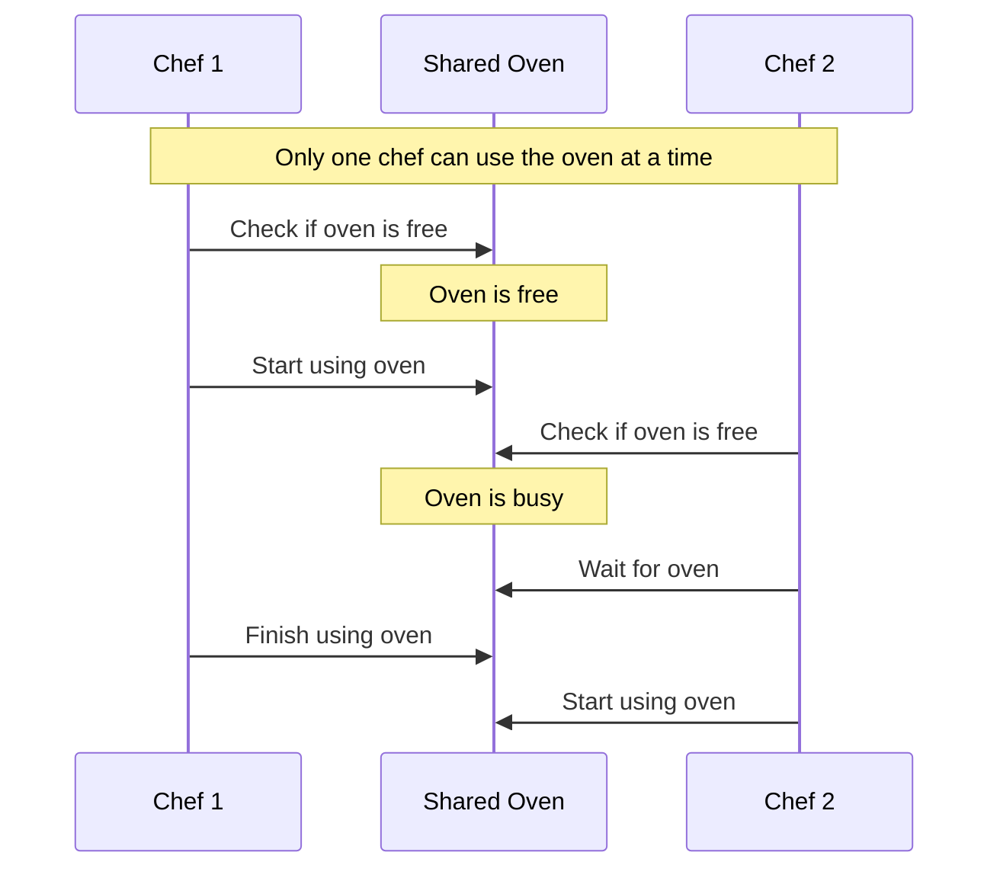
```mermaid
sequenceDiagram
    participant Chef1 as Chef 1
    participant Oven as Shared Oven
    participant Chef2 as Chef 2
    
    Note over Chef1,Chef2: Only one chef can use the oven at a time
    Chef1->>Oven: Check if oven is free
    Note over Oven: Oven is free
    Chef1->>Oven: Start using oven
    Chef2->>Oven: Check if oven is free
    Note over Oven: Oven is busy
    Chef2->>Oven: Wait for oven
    Chef1->>Oven: Finish using oven
    Chef2->>Oven: Start using oven
```

**Real-World Examples of Critical Sections:**
1. Printing a document (printer is shared)
2. Withdrawing money (bank account balance)
3. Booking a seat (airline reservation)

### Synchronization Tools

#### 1. Mutex (Mutual Exclusion)
Like a bathroom key - only one person can use it at a time

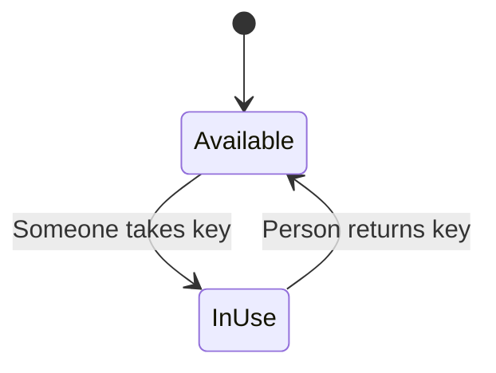
```mermaid
stateDiagram-v2
    [*] --> Available
    Available --> InUse: Someone takes key
    InUse --> Available: Person returns key
```

#### 2. Semaphore
Like a parking lot with limited spaces

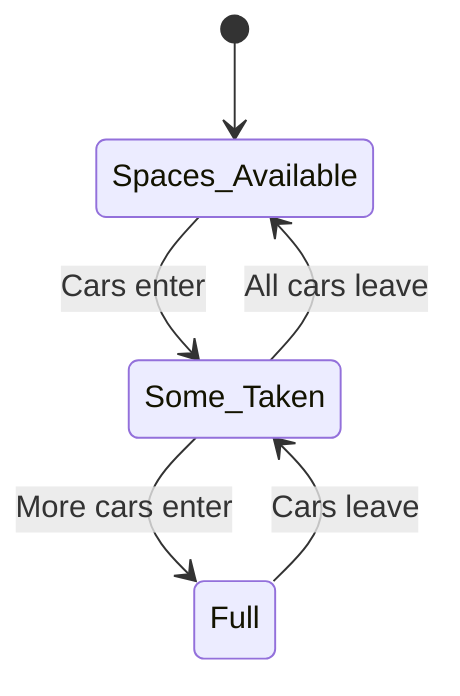
```mermaid
stateDiagram-v2
    [*] --> Spaces_Available
    Spaces_Available --> Some_Taken: Cars enter
    Some_Taken --> Full: More cars enter
    Full --> Some_Taken: Cars leave
    Some_Taken --> Spaces_Available: All cars leave
```

## Scheduling Algorithms with Examples

### 1. First-Come, First-Served (FCFS)
Like a simple queue at a grocery store


```mermaid
gantt
    title FCFS Scheduling
    dateFormat X
    axisFormat %L
    
    section Customer 1
    Checkout    :0, 5
    
    section Customer 2
    Checkout    :5, 9
    
    section Customer 3
    Checkout    :9, 12
```

### 2. Round Robin (RR)
Like a teacher giving equal time to each student


```mermaid
gantt
    title Round Robin (Time Slice = 3 minutes)
    dateFormat X
    axisFormat %L
    
    section Student 1
    Speaking    :0, 3
    Speaking    :9, 12
    
    section Student 2
    Speaking    :3, 6
    
    section Student 3
    Speaking    :6, 9
```

**Advantages and Disadvantages:**
- FCFS
  ✅ Simple and fair
  ❌ Long processes hold up others

- Round Robin
  ✅ Fair sharing of CPU
  ❌ More switching overhead

### 3. Priority Scheduling
Like an emergency room triage system

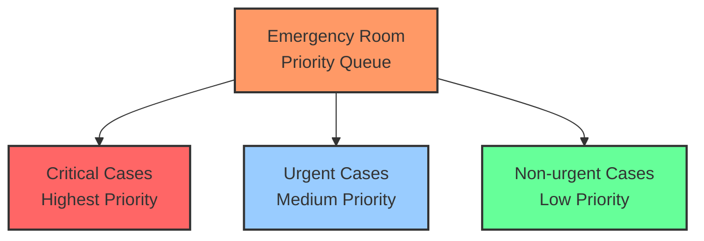
```mermaid
graph TD
    A[Emergency Room<br>Priority Queue]
    B[Critical Cases<br>Highest Priority]
    C[Urgent Cases<br>Medium Priority]
    D[Non-urgent Cases<br>Low Priority]
    
    A --> B
    A --> C
    A --> D
    
    style A fill:#f96,stroke:#333,stroke-width:2px
    style B fill:#f66,stroke:#333,stroke-width:2px
    style C fill:#9cf,stroke:#333,stroke-width:2px
    style D fill:#6f9,stroke:#333,stroke-width:2px
```

## Memory Management in Practice

### Virtual Memory: A Real-World Analogy

Imagine you're writing a research paper:
1. **Working Space (RAM)**: Your desk
2. **Storage (Hard Drive)**: Your filing cabinet
3. **Virtual Memory**: Your ability to work as if you had an infinite desk

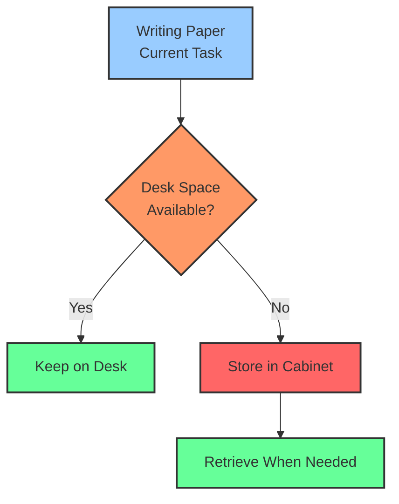
```mermaid
graph TD
    A[Writing Paper<br>Current Task] --> B{Desk Space<br>Available?}
    B -->|Yes| C[Keep on Desk]
    B -->|No| D[Store in Cabinet]
    D --> E[Retrieve When Needed]
    
    style A fill:#9cf,stroke:#333,stroke-width:2px
    style B fill:#f96,stroke:#333,stroke-width:2px
    style C fill:#6f9,stroke:#333,stroke-width:2px
    style D fill:#f66,stroke:#333,stroke-width:2px
    style E fill:#6f9,stroke:#333,stroke-width:2px
```

### Page Replacement: Like Organizing Your Desk

When your desk (RAM) is full, you need to decide what to move to the filing cabinet (Hard Drive):

1. **LRU (Least Recently Used)**
   - Move the paper you haven't looked at for the longest time
   - Like putting away old reference materials you haven't used lately

2. **FIFO (First In, First Out)**
   - Move the first paper you put on your desk
   - Simple but might move important stuff you still need

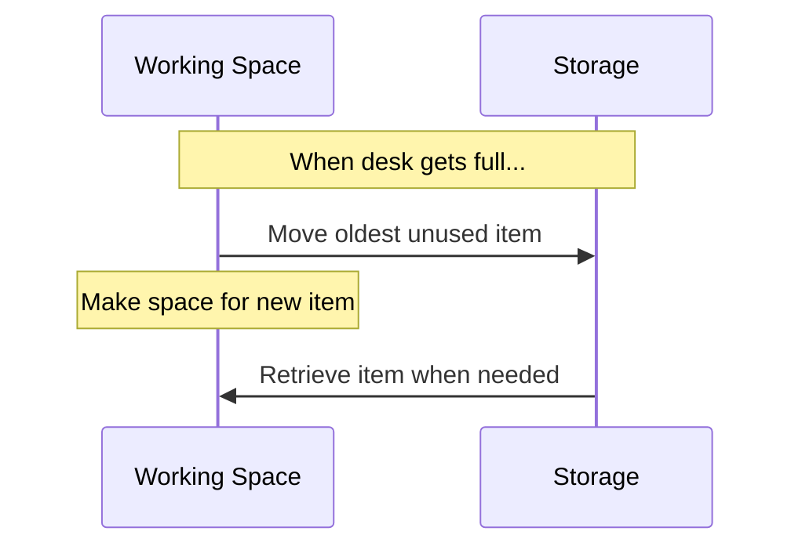
```mermaid
sequenceDiagram
    participant Desk as Working Space
    participant Cabinet as Storage
    
    Note over Desk,Cabinet: When desk gets full...
    Desk->>Cabinet: Move oldest unused item
    Note over Desk: Make space for new item
    Cabinet->>Desk: Retrieve item when needed
```

## I/O Systems Simplified

Think of I/O (Input/Output) systems like a company's mail room:

### I/O System Organization

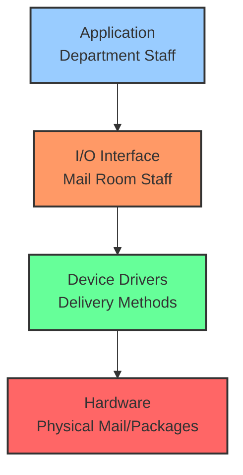
```mermaid
graph TD
    A[Application<br>Department Staff] --> B[I/O Interface<br>Mail Room Staff]
    B --> C[Device Drivers<br>Delivery Methods]
    C --> D[Hardware<br>Physical Mail/Packages]
    
    style A fill:#9cf,stroke:#333,stroke-width:2px
    style B fill:#f96,stroke:#333,stroke-width:2px
    style C fill:#6f9,stroke:#333,stroke-width:2px
    style D fill:#f66,stroke:#333,stroke-width:2px
```

**Real-World Analogy:**
1. **Application Level**: Like department staff requesting to send/receive mail
2. **I/O Interface**: Like mail room staff processing requests
3. **Device Drivers**: Like knowing how to handle different types of mail (letters, packages)
4. **Hardware**: The actual physical mail and delivery methods

### Types of I/O Operations

1. **Blocking I/O**
   - Like waiting at the counter until your package is processed
   - Program waits until I/O completes
   - Example: Reading a file and waiting for content

2. **Non-blocking I/O**
   - Like dropping off a package and getting a tracking number
   - Program continues while I/O processes
   - Example: Printing a document while continuing to work

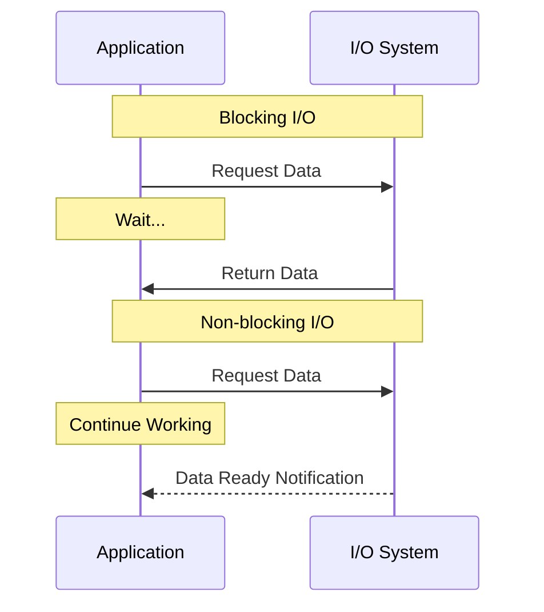
```mermaid
sequenceDiagram
    participant App as Application
    participant IO as I/O System
    
    Note over App,IO: Blocking I/O
    App->>IO: Request Data
    Note over App: Wait...
    IO->>App: Return Data
    
    Note over App,IO: Non-blocking I/O
    App->>IO: Request Data
    Note over App: Continue Working
    IO-->>App: Data Ready Notification
```

## Security Concepts Made Simple

### Security Layers (Like Home Security)

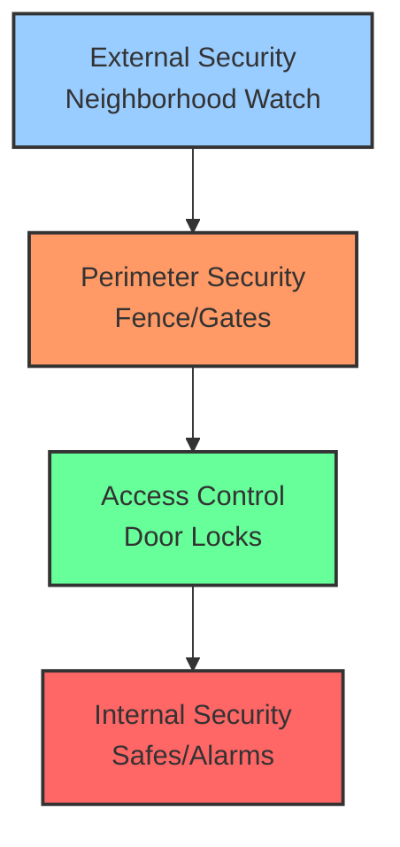
```mermaid
graph TD
    A[External Security<br>Neighborhood Watch] --> B[Perimeter Security<br>Fence/Gates]
    B --> C[Access Control<br>Door Locks]
    C --> D[Internal Security<br>Safes/Alarms]
    
    style A fill:#9cf,stroke:#333,stroke-width:2px
    style B fill:#f96,stroke:#333,stroke-width:2px
    style C fill:#6f9,stroke:#333,stroke-width:2px
    style D fill:#f66,stroke:#333,stroke-width:2px
```

### Authentication vs Authorization

Think of it like a concert:
- **Authentication**: Checking if your ticket is real (Are you who you say you are?)
- **Authorization**: Checking if your ticket gives access to VIP areas (What are you allowed to do?)

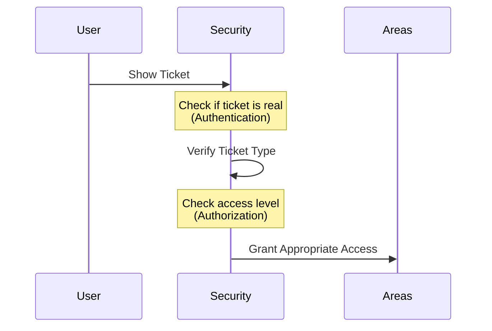
```mermaid
sequenceDiagram
    participant User
    participant Security
    participant Areas
    
    User->>Security: Show Ticket
    Note over Security: Check if ticket is real<br>(Authentication)
    Security->>Security: Verify Ticket Type
    Note over Security: Check access level<br>(Authorization)
    Security->>Areas: Grant Appropriate Access
```

### Common Security Threats and Protections

1. **Buffer Overflow**
   - Like overfilling a cup until it spills
   - Protection: Checking container sizes

2. **Privilege Escalation**
   - Like using an employee elevator to access restricted floors
   - Protection: Strict access controls

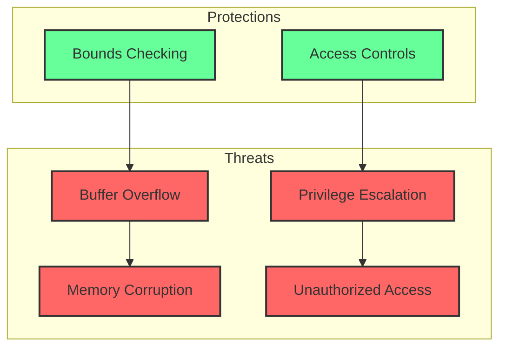
```mermaid
graph TD
    subgraph Threats
        A[Buffer Overflow] --> B[Memory Corruption]
        C[Privilege Escalation] --> D[Unauthorized Access]
    end
    
    subgraph Protections
        E[Bounds Checking] --> A
        F[Access Controls] --> C
    end
    
    style A fill:#f66,stroke:#333,stroke-width:2px
    style B fill:#f66,stroke:#333,stroke-width:2px
    style C fill:#f66,stroke:#333,stroke-width:2px
    style D fill:#f66,stroke:#333,stroke-width:2px
    style E fill:#6f9,stroke:#333,stroke-width:2px
    style F fill:#6f9,stroke:#333,stroke-width:2px
```

## Virtualization Explained

Think of virtualization like a shopping mall:

### Shopping Mall Analogy

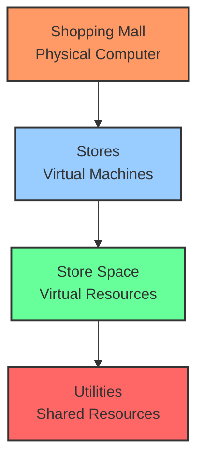
```mermaid
graph TD
    A[Shopping Mall<br>Physical Computer] --> B[Stores<br>Virtual Machines]
    B --> C[Store Space<br>Virtual Resources]
    C --> D[Utilities<br>Shared Resources]
    
    style A fill:#f96,stroke:#333,stroke-width:2px
    style B fill:#9cf,stroke:#333,stroke-width:2px
    style C fill:#6f9,stroke:#333,stroke-width:2px
    style D fill:#f66,stroke:#333,stroke-width:2px
```

**Components Explained:**
1. **Physical Computer (Shopping Mall)**
   - The actual hardware
   - Provides basic infrastructure

2. **Virtual Machines (Stores)**
   - Independent operating environments
   - Each has its own space and resources

3. **Hypervisor (Mall Management)**
   - Manages resource allocation
   - Ensures stores don't interfere with each other

### Types of Virtualization

1. **Full Virtualization**
   ```mermaid
   graph TD
       A[Physical Hardware] --> B[Hypervisor]
       B --> C[Complete VM 1]
       B --> D[Complete VM 2]
       
       style A fill:#f96,stroke:#333,stroke-width:2px
       style B fill:#9cf,stroke:#333,stroke-width:2px
       style C fill:#6f9,stroke:#333,stroke-width:2px
       style D fill:#6f9,stroke:#333,stroke-width:2px
   ```

2. **Container Virtualization**
   ```mermaid
   graph TD
       A[Physical Hardware] --> B[Host OS]
       B --> C[Container Engine]
       C --> D[Container 1]
       C --> E[Container 2]
       
       style A fill:#f96,stroke:#333,stroke-width:2px
       style B fill:#9cf,stroke:#333,stroke-width:2px
       style C fill:#6f9,stroke:#333,stroke-width:2px
       style D fill:#f66,stroke:#333,stroke-width:2px
       style E fill:#f66,stroke:#333,stroke-width:2px
   ```

## Practical Examples and Exercises

### 1. Process Management Exercise
```bash
# Create and observe processes
$ ps aux  # List all processes
$ top     # Monitor processes in real-time

# Understanding output:
USER    PID  %CPU  %MEM  COMMAND
root    1    0.0   0.1   /sbin/init
user    234  2.1   1.5   chrome
```

### 2. Memory Management Exercise
```bash
# Monitor memory usage
$ free -h  # Show memory usage
$ vmstat   # Virtual memory statistics

# Understanding output:
              total        used        free
Mem:           16G         8.2G        7.8G
Swap:          4G          0.5G        3.5G
```

### 3. File System Exercise
```bash
# Explore file system
$ df -h    # Disk usage
$ du -sh * # Directory sizes

# File permissions
$ ls -l
# Output explanation:
# -rw-r--r-- 1 user group 4096 Jan 1 12:00 file.txt
# |[-][-][--]| |  |    |    |    |    |    |
# |file type | |  |    |    |    |    |    filename
# |user perms| |  |    |    |    |    modification time
# |group perms |  |    |    |    file size
# |other perms |  |    |    group name
# |link count  |  |    user name
```

## Common Problems and Solutions

### 1. High CPU Usage
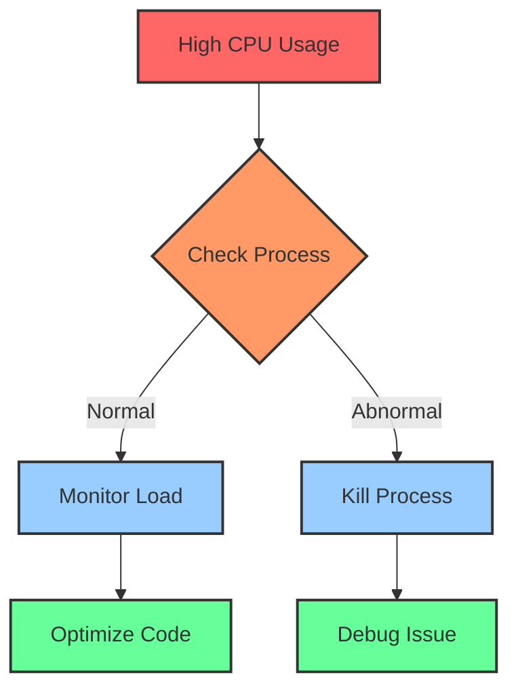
```mermaid
graph TD
    A[High CPU Usage] --> B{Check Process}
    B -->|Normal| C[Monitor Load]
    B -->|Abnormal| D[Kill Process]
    C --> E[Optimize Code]
    D --> F[Debug Issue]
    
    style A fill:#f66,stroke:#333,stroke-width:2px
    style B fill:#f96,stroke:#333,stroke-width:2px
    style C fill:#9cf,stroke:#333,stroke-width:2px
    style D fill:#9cf,stroke:#333,stroke-width:2px
    style E fill:#6f9,stroke:#333,stroke-width:2px
    style F fill:#6f9,stroke:#333,stroke-width:2px
```

### 2. Memory Leaks
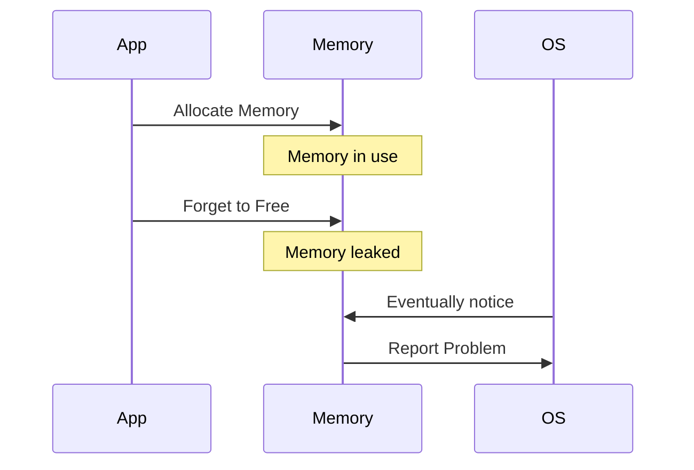
```mermaid
sequenceDiagram
    participant App
    participant Memory
    participant OS
    
    App->>Memory: Allocate Memory
    Note over Memory: Memory in use
    App->>Memory: Forget to Free
    Note over Memory: Memory leaked
    OS->>Memory: Eventually notice
    Memory->>OS: Report Problem
```

### 3. Disk Space Issues
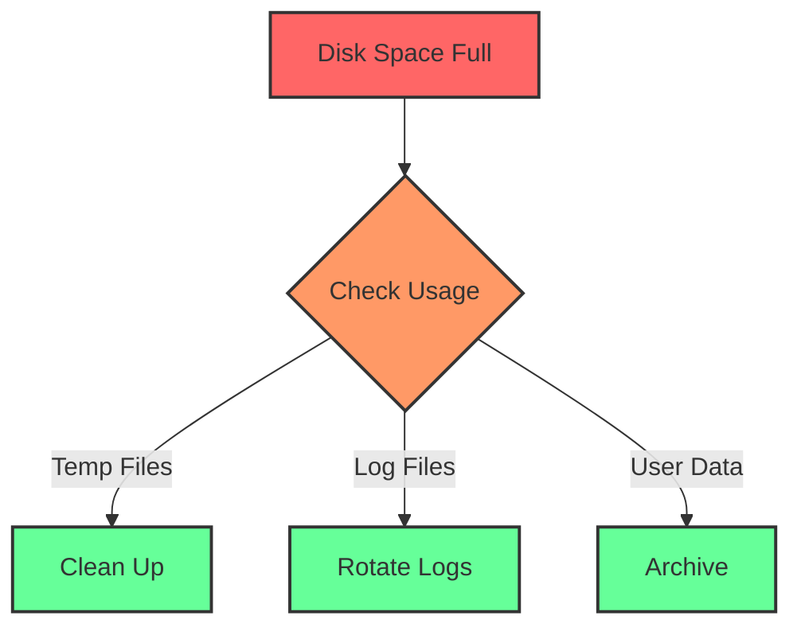
```mermaid
graph TD
    A[Disk Space Full] --> B{Check Usage}
    B -->|Temp Files| C[Clean Up]
    B -->|Log Files| D[Rotate Logs]
    B -->|User Data| E[Archive]
    
    style A fill:#f66,stroke:#333,stroke-width:2px
    style B fill:#f96,stroke:#333,stroke-width:2px
    style C fill:#6f9,stroke:#333,stroke-width:2px
    style D fill:#6f9,stroke:#333,stroke-width:2px
    style E fill:#6f9,stroke:#333,stroke-width:2px
```

## Troubleshooting Guide

### Common Issues and Solutions

#### 1. System Performance Problems

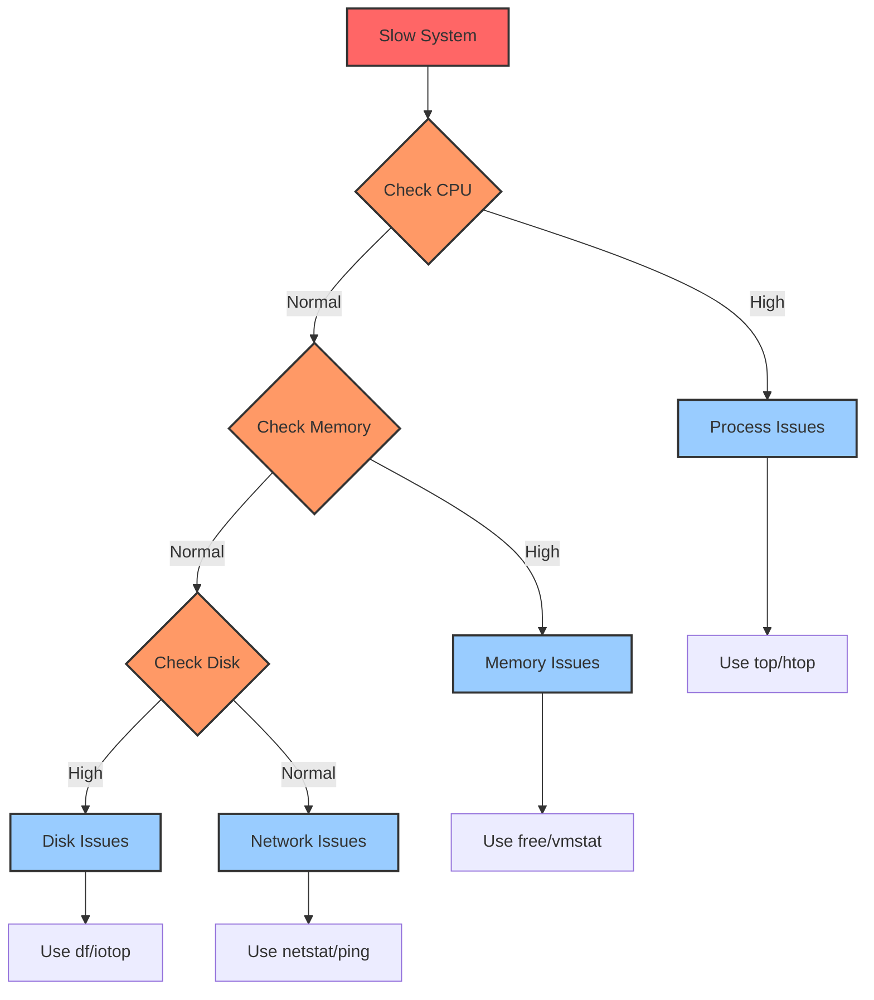
```mermaid
flowchart TD
    A[Slow System] --> B{Check CPU}
    B -->|High| C[Process Issues]
    B -->|Normal| D{Check Memory}
    D -->|High| E[Memory Issues]
    D -->|Normal| F{Check Disk}
    F -->|High| G[Disk Issues]
    F -->|Normal| H[Network Issues]
    
    C --> I[Use top/htop]
    E --> J[Use free/vmstat]
    G --> K[Use df/iotop]
    H --> L[Use netstat/ping]
    
    style A fill:#f66,stroke:#333,stroke-width:2px
    style B fill:#f96,stroke:#333,stroke-width:2px
    style C fill:#9cf,stroke:#333,stroke-width:2px
    style D fill:#f96,stroke:#333,stroke-width:2px
    style E fill:#9cf,stroke:#333,stroke-width:2px
    style F fill:#f96,stroke:#333,stroke-width:2px
    style G fill:#9cf,stroke:#333,stroke-width:2px
    style H fill:#9cf,stroke:#333,stroke-width:2px
```

#### Quick Reference Commands
```bash
# CPU Issues
top -u username     # Check CPU by user
ps aux --sort=-%cpu # Sort by CPU usage

# Memory Issues
free -h             # Human-readable memory stats
vmstat 1            # Memory stats every second

# Disk Issues
df -h               # Disk space usage
iotop               # Disk I/O monitoring

# Network Issues
netstat -tuln       # Active connections
ping google.com     # Network connectivity
```

### Best Practices

#### 1. System Monitoring

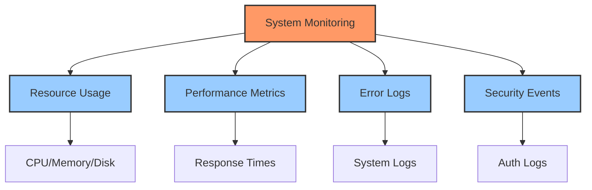
```mermaid
graph TD
    A[System Monitoring] --> B[Resource Usage]
    A --> C[Performance Metrics]
    A --> D[Error Logs]
    A --> E[Security Events]
    
    B --> F[CPU/Memory/Disk]
    C --> G[Response Times]
    D --> H[System Logs]
    E --> I[Auth Logs]
    
    style A fill:#f96,stroke:#333,stroke-width:2px
    style B fill:#9cf,stroke:#333,stroke-width:2px
    style C fill:#9cf,stroke:#333,stroke-width:2px
    style D fill:#9cf,stroke:#333,stroke-width:2px
    style E fill:#9cf,stroke:#333,stroke-width:2px
```

#### 2. Maintenance Schedule

```mermaid
gantt
    title System Maintenance Schedule
    dateFormat X
    axisFormat %L
    
    section Daily
    Security Updates    :0, 2
    Log Review         :2, 4
    
    section Weekly
    Full Backup        :0, 2
    Disk Cleanup       :2, 4
    
    section Monthly
    Performance Audit  :0, 2
    Security Scan     :2, 4
```

### Performance Optimization Tips

1. **CPU Optimization**
   - Use appropriate scheduling priorities
   - Minimize context switches
   - Profile and optimize heavy processes

2. **Memory Optimization**
   - Monitor and control memory leaks
   - Use appropriate page sizes
   - Optimize cache usage

3. **Disk I/O Optimization**
   - Use appropriate file systems
   - Implement proper buffering
   - Regular defragmentation

4. **Network Optimization**
   - Implement proper caching
   - Use connection pooling
   - Optimize packet sizes

## Quick Reference Guide

### Essential Commands

```bash
# System Information
uname -a          # System info
lscpu             # CPU info
free -h           # Memory info
df -h             # Disk info

# Process Management
ps aux            # List processes
kill -9 PID       # Force kill process
nice -n 10 cmd    # Run with priority

# File Operations
ls -la            # List files with details
chmod 755 file    # Change permissions
chown user file   # Change ownership

# Network Operations
ifconfig          # Network interfaces
netstat -tuln     # Network connections
tcpdump           # Packet capture
```

### Common Error Messages Explained

```mermaid
graph TD
    A[Common Errors] --> B[Permission Denied]
    A --> C[Out of Memory]
    A --> D[Disk Full]
    A --> E[Process Killed]
    
    B --> F[Check permissions<br>Use sudo if needed]
    C --> G[Free memory<br>Check memory leaks]
    D --> H[Clean up space<br>Check large files]
    E --> I[Check system logs<br>Monitor resources]
    
    style A fill:#f96,stroke:#333,stroke-width:2px
    style B fill:#f66,stroke:#333,stroke-width:2px
    style C fill:#f66,stroke:#333,stroke-width:2px
    style D fill:#f66,stroke:#333,stroke-width:2px
    style E fill:#f66,stroke:#333,stroke-width:2px
```

## Learning Path Recommendations

### 1. Beginner Level
- Basic command line operations
- Process and file management
- Simple troubleshooting

### 2. Intermediate Level
- System administration
- Performance monitoring
- Basic scripting

### 3. Advanced Level
- Kernel customization
- System optimization
- Security hardening

```mermaid
graph TD
    A[Beginner] --> B[Intermediate]
    B --> C[Advanced]
    
    A --> D[Commands]
    A --> E[File Systems]
    A --> F[Processes]
    
    B --> G[Administration]
    B --> H[Monitoring]
    B --> I[Scripting]
    
    C --> J[Kernel]
    C --> K[Security]
    C --> L[Optimization]
    
    style A fill:#9cf,stroke:#333,stroke-width:2px
    style B fill:#f96,stroke:#333,stroke-width:2px
    style C fill:#f66,stroke:#333,stroke-width:2px
```

## Additional Resources

### Online Courses
1. Linux Foundation Courses: https://training.linuxfoundation.org/
2. Red Hat Training: https://www.redhat.com/en/services/training
3. Unix/Linux Tutorial: https://www.tutorialspoint.com/unix/

### Books for Different Levels
1. **Beginner**
   - "How Linux Works" by Brian Ward
   - "Linux Command Line" by William Shotts

2. **Intermediate**
   - "Unix and Linux System Administration Handbook"
   - "Linux Bible" by Christopher Negus

3. **Advanced**
   - "Linux Kernel Development" by Robert Love
   - "Understanding the Linux Kernel" by Daniel P. Bovet

### Practice Environments
1. Virtual Machines
   - VirtualBox
   - VMware

2. Online Labs
   - Katacoda
   - Linux Academy

3. Container-based Practice
   - Docker
   - Kubernetes

Remember: The best way to learn is by doing. Start with basic commands and gradually work your way up to more complex topics.

## Common Interview Topics - Detailed Questions and Answers

### 1. Deadlock
#### Key Questions:
1. **What is deadlock and what conditions are necessary for it to occur?**
   - Answer: Deadlock is a situation where two or more processes are unable to proceed because each is waiting for resources held by another. Four conditions are necessary:
     - Mutual Exclusion: Resources cannot be shared
     - Hold and Wait: Processes hold resources while waiting for others
     - No Preemption: Resources cannot be forcibly taken away
     - Circular Wait: Processes form a circular chain of resource requests

2. **How can deadlocks be prevented?**
   - Answer: Deadlocks can be prevented by breaking any of the four necessary conditions:
     - Break Mutual Exclusion: Use shareable resources
     - Break Hold and Wait: Request all resources at once
     - Allow Preemption: Enable resource reallocation
     - Break Circular Wait: Order resource allocation

```mermaid
graph TD
    A[Deadlock Prevention] --> B[Break Mutual Exclusion]
    A --> C[Break Hold and Wait]
    A --> D[Allow Preemption]
    A --> E[Break Circular Wait]
    
    style A fill:#f96,stroke:#333,stroke-width:2px
    style B fill:#9cf,stroke:#333,stroke-width:2px
    style C fill:#9cf,stroke:#333,stroke-width:2px
    style D fill:#9cf,stroke:#333,stroke-width:2px
    style E fill:#9cf,stroke:#333,stroke-width:2px
```

3. **What's the difference between deadlock prevention and deadlock avoidance?**
   - Answer:
     - Prevention: Eliminates necessary conditions, more restrictive but guaranteed
     - Avoidance: Uses runtime information to make safe allocation decisions
     - Example: Banker's Algorithm for avoidance

### 2. Synchronization
#### Key Questions:
1. **What's the difference between a mutex and a semaphore?**
   - Answer:
     - Mutex: Binary (0/1) ownership mechanism, must be released by owner
     - Semaphore: Counter mechanism, can be released by any process
     - Use Mutex for: Exclusive access to single resource
     - Use Semaphore for: Managing resource pools

2. **Explain the Producer-Consumer problem and its solution.**
   - Answer: 
     ```c
     // Shared buffer with semaphores
     semaphore empty = N;  // Buffer slots available
     semaphore full = 0;   // Items in buffer
     semaphore mutex = 1;  // Binary semaphore for buffer access
     
     Producer() {
         while(true) {
             wait(empty);     // Wait for empty slot
             wait(mutex);     // Enter critical section
             add_item();      // Add to buffer
             signal(mutex);   // Exit critical section
             signal(full);    // Signal item added
         }
     }
     
     Consumer() {
         while(true) {
             wait(full);      // Wait for item
             wait(mutex);     // Enter critical section
             remove_item();   // Remove from buffer
             signal(mutex);   // Exit critical section
             signal(empty);   // Signal slot freed
         }
     }
     ```

3. **What is priority inversion and how can it be solved?**
   - Answer:
     - Problem: Lower priority process holds resource needed by higher priority process
     - Solution: Priority Inheritance Protocol
       - Temporarily boost priority of resource holder
       - Return to normal priority after releasing resource

### 3. Memory Management
#### Key Questions:
1. **Explain virtual memory and its benefits.**
   - Answer:
     - Virtual memory creates an abstraction of larger memory space
     - Benefits:
       - Process isolation
       - Memory protection
       - Efficient memory utilization
       - Simplified programming model

```mermaid
graph TD
    A[Virtual Memory] --> B[Process Isolation]
    A --> C[Memory Protection]
    A --> D[Efficient Usage]
    A --> E[Simple Programming]
    
    style A fill:#f96,stroke:#333,stroke-width:2px
    style B fill:#9cf,stroke:#333,stroke-width:2px
    style C fill:#9cf,stroke:#333,stroke-width:2px
    style D fill:#9cf,stroke:#333,stroke-width:2px
    style E fill:#9cf,stroke:#333,stroke-width:2px
```

2. **Compare different page replacement algorithms.**
   - Answer:
     - FIFO (First In First Out):
       - Simple but can remove important pages
       - Suffers from Belady's anomaly
     - LRU (Least Recently Used):
       - Optimal for temporal locality
       - Expensive to implement perfectly
     - Clock Algorithm:
       - Approximation of LRU
       - Good performance/complexity trade-off

3. **What is thrashing and how can it be prevented?**
   - Answer:
     - Thrashing: Excessive paging due to insufficient memory
     - Prevention:
       - Proper memory allocation
       - Working set model
       - Page fault frequency control
       - Load control

### 4. Process Scheduling
#### Key Questions:
1. **Compare different scheduling algorithms.**
   - Answer:
     ```
     FCFS (First Come First Served):
     - Simple, fair
     - Poor for short processes after long ones
     
     SJF (Shortest Job First):
     - Optimal average waiting time
     - Starvation possible
     - Hard to predict job length
     
     Round Robin:
     - Fair, good response time
     - Time quantum selection critical
     - Higher context switch overhead
     ```

2. **What is multilevel feedback queue scheduling?**
   - Answer:
     - Multiple queues with different priorities
     - Processes move between queues based on behavior
     - Benefits:
       - Favors short, I/O bound processes
       - Adapts to process behavior
       - Prevents starvation

```mermaid
graph TD
    A[High Priority Queue] --> D[CPU]
    B[Medium Priority Queue] --> D
    C[Low Priority Queue] --> D
    
    style A fill:#f66,stroke:#333,stroke-width:2px
    style B fill:#f96,stroke:#333,stroke-width:2px
    style C fill:#9cf,stroke:#333,stroke-width:2px
    style D fill:#6f9,stroke:#333,stroke-width:2px
```

3. **Explain real-time scheduling requirements.**
   - Answer:
     - Hard real-time: Absolute deadlines
     - Soft real-time: Flexible deadlines
     - Requirements:
       - Predictable response time
       - Priority-based preemption
       - Admission control
       - Resource reservation

### 5. File Systems
#### Key Questions:
1. **Compare different file allocation methods.**
   - Answer:
     - Contiguous Allocation:
       - Fast sequential access
       - External fragmentation issues
     - Linked Allocation:
       - No external fragmentation
       - Poor random access
     - Indexed Allocation:
       - Good for both sequential and random
       - Space overhead for index

2. **How does journaling in file systems work?**
   - Answer:
     - Records changes in journal before applying
     - Recovery steps:
       1. Read journal
       2. Replay uncommitted transactions
       3. Undo incomplete transactions
     - Types:
       - Metadata journaling
       - Full data journaling

3. **Explain RAID configurations and their trade-offs.**
   - Answer:
     ```
     RAID 0: Striping
     - High performance
     - No redundancy
     
     RAID 1: Mirroring
     - Full redundancy
     - Higher cost
     
     RAID 5: Striping with parity
     - Good balance of performance/redundancy
     - One drive failure tolerance
     
     RAID 10: Striping + Mirroring
     - Best performance and redundancy
     - Highest cost
     ```

### Practice Questions:
1. Design a simple file system with basic operations (create, read, write, delete).
2. Implement a basic process scheduler with priority queues.
3. Write code for the dining philosophers problem using semaphores.
4. Design a memory management system with paging and page replacement.
5. Implement a basic shell that can execute commands and manage processes.

### Common Debugging Scenarios:
1. **High CPU Usage**
   - Check: top, ps, strace
   - Look for: Infinite loops, resource leaks

2. **Memory Leaks**
   - Tools: valgrind, memory profilers
   - Check: Process memory growth over time

3. **Deadlock Detection**
   - Tools: Process state analysis
   - Look for: Waiting processes, resource holds

4. **File System Issues**
   - Tools: fsck, disk usage analyzers
   - Check: Inode usage, disk space, file permissions
