# Computer Networking Fundamentals
Computer networking is a fundamental aspect of modern computing, as it enables devices to communicate and share information with each other. This guide provides a comprehensive overview of networking concepts that senior software engineers should understand.

## The OSI Model
The OSI (Open Systems Interconnection) model is a conceptual framework that standardizes the functions of a networking system into seven abstraction layers:

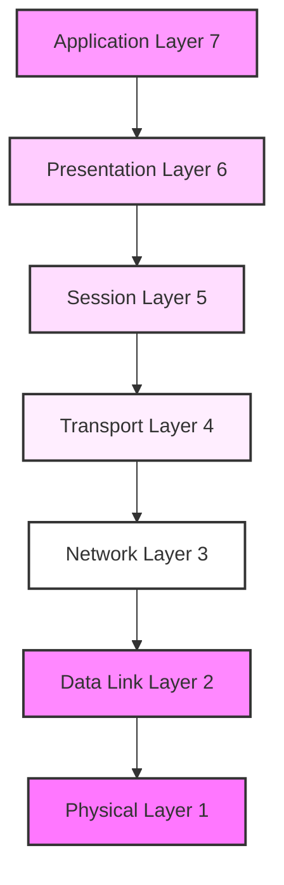

1. **Physical Layer (Layer 1)**
   - Deals with the physical transmission of raw bits
   - Includes specifications for voltage levels, timing, physical data rates, physical connectors
   - Examples: Ethernet cables, fiber optic cables, wireless signals

2. **Data Link Layer (Layer 2)**
   - Handles node-to-node data delivery
   - Manages physical addressing (MAC addresses)
   - Error detection and correction
   - Examples: Ethernet protocol, Wi-Fi 802.11, Switches

3. **Network Layer (Layer 3)**
   - Manages addressing, routing, and traffic control
   - Handles logical addressing (IP addresses)
   - Examples: IP (IPv4, IPv6), ICMP, routers

4. **Transport Layer (Layer 4)**
   - Provides end-to-end communication control
   - Handles reliability, flow control, and error recovery
   - Examples: TCP (reliable), UDP (unreliable but fast)

5. **Session Layer (Layer 5)**
   - Manages sessions between applications
   - Handles authentication and reconnection
   - Examples: NetBIOS, RPC

6. **Presentation Layer (Layer 6)**
   - Handles data translation and encryption
   - Manages data formatting and encoding
   - Examples: SSL/TLS, JPEG, ASCII

7. **Application Layer (Layer 7)**
   - Provides network services to applications
   - User-facing protocols and data handling
   - Examples: HTTP, FTP, SMTP, DNS

## Network Topology
Network topology refers to the layout and configuration of a network. There are several types of network topologies, including:

**Star topology**: A star topology consists of a central hub or switch that connects to all other devices on the network. Each device has its own dedicated connection to the hub, which allows for more efficient communication.

**Bus topology**: A bus topology consists of a single cable that connects all devices on the network. Data is transmitted through the cable and all devices can access it.

**Ring topology**: A ring topology consists of a loop of cable that connects all devices on the network. Data is transmitted in a circular fashion, with each device passing it on to the next.

**Mesh topology**: A mesh topology consists of multiple devices that are connected to one another through multiple connections. This allows for multiple paths for data to travel, which can improve reliability and redundancy.

### Star Topology
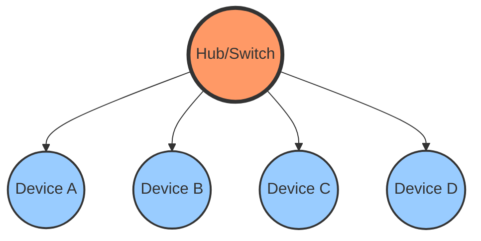

### Bus Topology
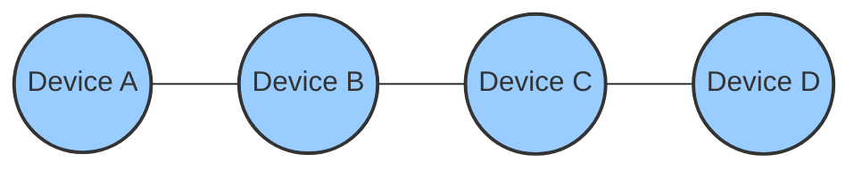

### Ring Topology
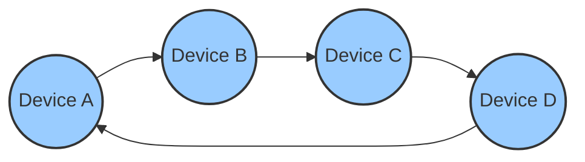

### Mesh Topology
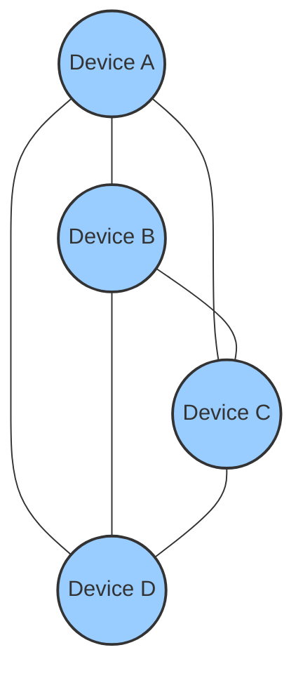

## Protocols
A protocol is a set of rules and standards that define the way devices communicate with each other on a network. Some common protocols used in computer networking include:

**TCP/IP**: TCP/IP (Transmission Control Protocol/Internet Protocol) is a suite of protocols that defines the communication rules for transferring data on the internet. TCP is responsible for establishing and maintaining a connection between two devices and ensuring that the data being transmitted is delivered correctly, while IP is responsible for routing the packets to their destination.

**HTTP**: HTTP (Hypertext Transfer Protocol) is a communication protocol used for transferring data on the World Wide Web. It allows a client (such as a web browser) to send a request to a server and receive a response. HTTP uses a simple, text-based syntax and is used to request resources such as HTML documents, images, and videos from a server.

**HTTPS**: HTTPS (HTTP Secure) is an extension of HTTP that adds a layer of security through the use of encryption. It uses a secure socket layer (SSL) or transport layer security (TLS) to encrypt the communication between the client and the server, ensuring that the data being transmitted cannot be intercepted and read by third parties.

**FTP**: FTP (File Transfer Protocol) is a communication protocol used for transferring files between computers on a network. It allows a client to upload and download files to and from a server. FTP uses a simple, text-based syntax and supports both active and passive modes for transferring data.

**SMTP**: SMTP (Simple Mail Transfer Protocol) is a communication protocol used for sending email messages between servers. It allows a client to send an email message to a server, which will then forward the message to the intended recipient. SMTP uses a simple, text-based syntax and is responsible for delivering the message to the correct server.

## Networking Hardware
Networking hardware refers to the physical devices that are used to connect and communicate on a network. Some common types of networking hardware include:

**Routers**: Routers are devices that connect different networks and route traffic between them. They use routing tables to determine the most efficient path for data to travel.

**Switches**: Switches are devices that connect devices on a local network and allow them to communicate with each other. They use MAC addresses to identify devices on the network and forward data between them.

**Hubs**: Hubs are devices that connect devices on a network and allow them to communicate with each other. They broadcast incoming data to all connected devices, regardless of the intended recipient.

**Modems**: Modems are devices that convert digital signals to analog signals and vice versa. They are used to connect devices to the internet or other networks through phone lines, cable lines, or satellite connections.

**NICs**: NICs (Network Interface Cards) are hardware devices that connect a device to a network. They are typically installed in computers and provide a physical connection to the network through a cable.

## Networking Services
Networking services are programs or processes that run on a network and provide specific functions or features to users. Some common networking services include:

**DNS**: DNS (Domain Name System) is a service that translates human-readable domain names (such as www.example.com) into IP addresses that computers can understand. It allows users to access websites and other online resources using familiar, easy-to-remember names.

**DHCP**: DHCP (Dynamic Host Configuration Protocol) is a service that automatically assigns IP addresses to devices on a network. It allows devices to connect to the network and receive necessary configuration information without the need for manual configuration.

**Web servers**: Web servers are programs that host websites and serve content to users on the internet. They receive requests from clients (such as web browsers) and return the requested content in the form of HTML documents, images, and other media.

**File servers**: File servers are programs that host files and allow users to access them over a network. They provide a central location for storing and sharing files, making it easier for multiple users to access and collaborate on them.

**Print servers**: Print servers are programs that manage print jobs on a network. They receive print requests from clients and send them to the appropriate printer, allowing users to print from any device on the network.
Networking Security
Networking security refers to the measures taken to protect a network and its devices from unauthorized access and attacks. Some common techniques used in networking security include:

**Firewalls**: Firewalls are software or hardware devices that act as a barrier between a network and the internet. They filter incoming and outgoing traffic based on predetermined rules, blocking potentially malicious traffic and allowing legitimate traffic to pass through.

**Encryption**: Encryption is the process of encoding data in such a way that it can only be accessed by someone with the correct decryption key. It is used to secure communication and protect sensitive data from being intercepted and read by unauthorized parties.

**Authentication**: Authentication is the process of verifying the identity of a user or device. It is used to ensure that only authorized users have access to certain resources or services.

**Access control**: Access control is the process of regulating the access of users or devices to certain resources or services. It is used to ensure that only authorized users have access to sensitive data or systems.

## Networking Tools
Networking tools are programs or devices that are used to diagnose, troubleshoot, and manage a network. Some common networking tools include:

**Ping**: Ping is a utility that sends a small packet of data to a specified host and measures the time it takes for the host to respond. It is used to test the connectivity and responsiveness of a network or device.

**Traceroute**: Traceroute is a utility that traces the route that a packet of data takes from its source to its destination. It is used to diagnose issues with network connectivity and identify bottlenecks or other problems.

**Telnet**: Telnet is a command-line utility that allows users to connect to and remotely manage servers or devices over a network. It is commonly used for administering servers or performing remote troubleshooting.

**Wireshark**: Wireshark is a network protocol analyzer that captures and displays network traffic in real-time. It is used to diagnose and troubleshoot network issues, as well as to analyze and optimize network performance.

**Netstat**: Netstat is a command-line utility that displays information about active network connections, including the protocol being used, the local and remote addresses, and the state of the connection. It is used to diagnose issues with network connectivity and performance.

## Networking Terminology
Here are some additional terms that are commonly used in the field of computer networking:

**IP address**: An IP address is a numerical label assigned to each device connected to a computer network that uses the Internet Protocol for communication. It serves as a unique identifier for the device and allows it to be located and accessed on the network.

**MAC address**: A MAC (Media Access Control) address is a unique identifier assigned to the network interface of a device. It is used to identify the device on the network and allow it to communicate with other devices.

**Port**: A port is a logical connection point on a device that is used to communicate with other devices on a network. Each port is assigned a unique number, which is used to identify the service or application running on the port.

**Packet**: A packet is a unit of data that is transmitted over a network. It consists of a header, which contains information about the packet's origin, destination, and the type of data being transmitted, and a payload, which contains the actual data being transmitted.

**Protocol stack**: A protocol stack is a set of protocols that work together to provide a complete networking solution. Each protocol in the stack performs a specific function, and the stack as a whole enables devices to communicate with each other.

## Example Scenario
Here is an example scenario to illustrate how these concepts might come into play in a real-world situation:

1. A user wants to access a website on the internet using their web browser.
2. The user's computer sends a request to the router, which is responsible for connecting the computer to the internet.
3. The router receives the request and uses its routing table to determine the most efficient path for the request to take.
4. The router sends the request to the appropriate server on the internet via an internet service provider (ISP).
5. The server receives the request and processes it using HTTP, a communication protocol for transferring data on the web.
6. The server sends the requested HTML document back to the user's computer via the router.
7. The user's web browser receives the HTML document and renders it for the user to view.

In this scenario, several networking concepts are at play, including network topology (the layout and configuration of the user's home network and the internet), protocols (such as HTTP and TCP/IP), networking hardware (the router and the user's computer), and networking services (the web server hosting the website). Additionally, networking security measures (such as firewalls and encryption) may be in place to protect the network and its devices from malicious attacks.

## TCP/IP Protocol Suite
The TCP/IP protocol suite is the foundation of the internet and most modern networks. It consists of several key protocols:

### TCP (Transmission Control Protocol)
- Connection-oriented protocol
- Guarantees reliable, ordered delivery of data
- Handles flow control and congestion control
- Used by HTTP, FTP, SMTP, and other protocols requiring reliable delivery

### UDP (User Datagram Protocol)
- Connectionless protocol
- No guarantee of delivery, ordering, or integrity
- Lower latency than TCP
- Used for real-time applications like video streaming, gaming, and VoIP

### IP (Internet Protocol)
- Handles addressing and routing
- Two versions: IPv4 (32-bit addresses) and IPv6 (128-bit addresses)
- Responsible for packet forwarding across networks

### TCP Three-Way Handshake
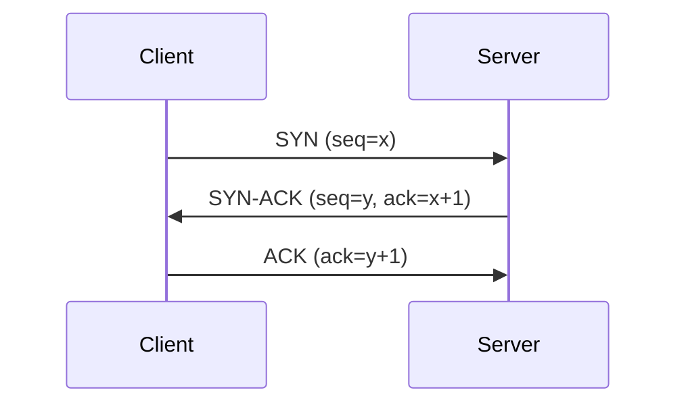

### HTTP Request-Response Flow
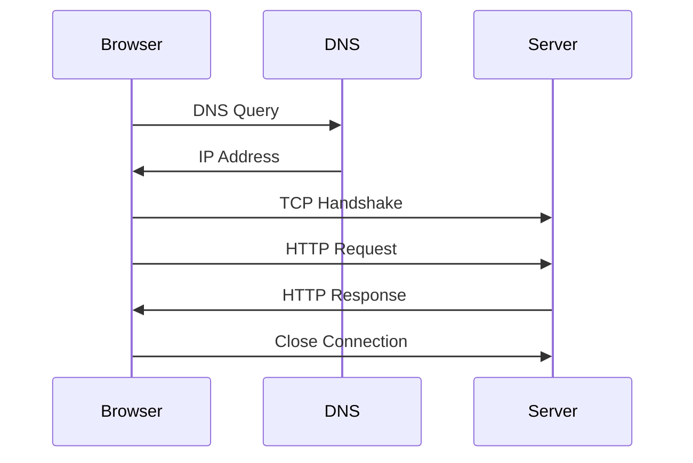

## Advanced Networking Concepts

### Load Balancing
Load balancing distributes incoming network traffic across multiple servers to ensure high availability and reliability. Common algorithms include:
- Round Robin
- Least Connections
- IP Hash
- Weighted Round Robin

### Content Delivery Networks (CDN)
CDNs are distributed networks of servers that deliver web content to users based on their geographic location, improving:
- Load times
- Bandwidth costs
- Availability and redundancy
- DDoS protection

### Software-Defined Networking (SDN)
SDN separates the network's control logic (control plane) from the underlying hardware (data plane), enabling:
- Centralized network management
- Programmable network behavior
- More flexible and efficient resource utilization

## References and Further Reading

### Books
1. "Computer Networks" by Andrew S. Tanenbaum and David J. Wetherall
2. "TCP/IP Illustrated" by W. Richard Stevens
3. "Network Warrior" by Gary A. Donahue

### Online Resources
1. Cisco Networking Academy: https://www.netacad.com/
2. Internet Engineering Task Force (IETF): https://www.ietf.org/
3. Computer Networks Course (Stanford): https://cs144.github.io/

### RFCs (Request for Comments)
1. RFC 791 - Internet Protocol
2. RFC 793 - Transmission Control Protocol
3. RFC 2616 - HTTP/1.1
4. RFC 7540 - HTTP/2
5. RFC 9114 - HTTP/3

### Tools and Documentation
1. Wireshark Documentation: https://www.wireshark.org/docs/
2. nmap Documentation: https://nmap.org/book/
3. tcpdump Tutorial: https://danielmiessler.com/study/tcpdump/

## Network Troubleshooting Guide

### Common Network Issues and Solutions

#### 1. Connectivity Issues
- **Symptom**: No network access
- **Tools**: 
  ```bash
  ping 8.8.8.8  # Test internet connectivity
  nslookup google.com  # Test DNS resolution
  traceroute google.com  # Trace network path
  ```
- **Common Solutions**:
  - Check physical connections
  - Verify IP configuration (`ipconfig` / `ifconfig`)
  - Reset network hardware
  - Check DNS settings

#### 2. Performance Issues
- **Symptom**: Slow network speeds
- **Tools**:
  ```bash
  speedtest-cli  # Test network speed
  iperf3  # Measure network throughput
  netstat -tuln  # View network connections
  ```
- **Common Solutions**:
  - Check for network congestion
  - Monitor bandwidth usage
  - Verify QoS settings
  - Update network drivers

#### 3. DNS Issues
- **Symptom**: Cannot resolve domain names
- **Tools**:
  ```bash
  dig example.com  # Detailed DNS query
  host example.com  # Simple DNS lookup
  cat /etc/resolv.conf  # Check DNS configuration
  ```
- **Common Solutions**:
  - Check DNS server settings
  - Clear DNS cache
  - Try alternative DNS servers
  - Verify domain registration

### Network Analysis Tools

#### 1. Wireshark
```bash
# Capture HTTP traffic on interface eth0
wireshark -i eth0 -f "port 80"

# Save capture to file
wireshark -i eth0 -w capture.pcap
```

#### 2. tcpdump
```bash
# Capture HTTP traffic
tcpdump -i eth0 port 80

# Capture traffic to/from specific host
tcpdump host 192.168.1.1
```

#### 3. netstat
```bash
# List all listening ports
netstat -tuln

# Show all active connections
netstat -an
```

## Real-World Examples

### Example 1: Web Application Architecture
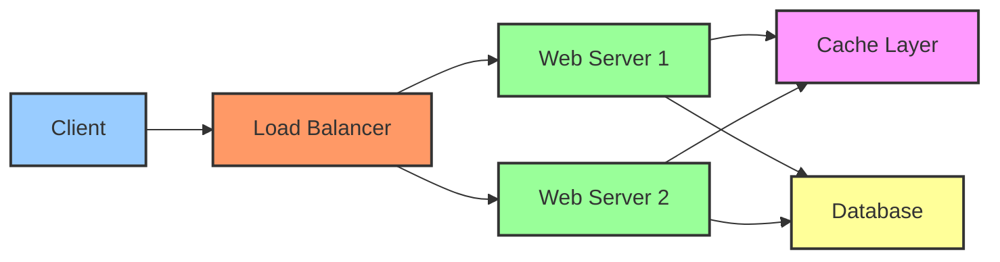

Key Components:
1. Load Balancer (e.g., NGINX, HAProxy)
2. Web Servers (e.g., Apache, NGINX)
3. Application Servers (e.g., Node.js, Java)
4. Database (e.g., PostgreSQL, MongoDB)
5. Cache Layer (e.g., Redis, Memcached)
6. Message Queue (e.g., RabbitMQ, Kafka)

### Example 2: Microservices Communication
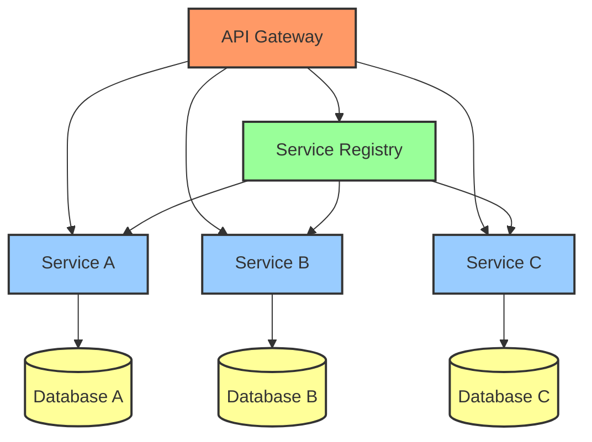

Communication Patterns:
1. Synchronous (REST, gRPC)
2. Asynchronous (Message Queues)
3. Service Discovery
4. Circuit Breaking
5. Rate Limiting

### Example 3: Container Networking
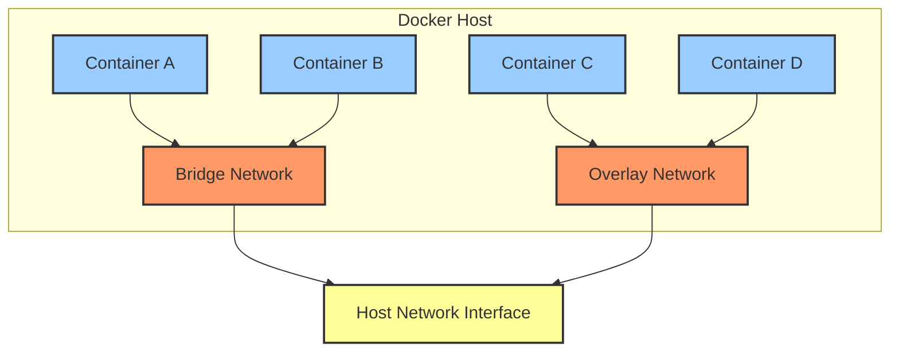

Network Types:
1. Bridge Network
2. Host Network
3. Overlay Network
4. Macvlan Network

## Performance Optimization Tips

### 1. Network Level
- Enable HTTP/2 or HTTP/3
- Use connection pooling
- Implement request caching
- Configure proper TCP settings
- Optimize DNS resolution

### 2. Application Level
- Minimize request/response payload size
- Use compression (gzip, Brotli)
- Implement proper timeout handling
- Use connection keep-alive
- Implement retry mechanisms

### 3. Infrastructure Level
- Use CDN for static content
- Implement proper load balancing
- Configure auto-scaling
- Monitor network metrics
- Use proper caching strategies

## Network Security Best Practices

### 1. Defense in Depth
- Implement multiple layers of security
- Use firewalls at different network levels
- Segment networks appropriately
- Apply the principle of least privilege

### 2. Encryption and Authentication
- Use TLS 1.3 for all public-facing services
- Implement certificate pinning
- Use strong authentication mechanisms
- Rotate credentials regularly
- Implement MFA where possible

### 3. Network Monitoring
- Set up intrusion detection systems (IDS)
- Use network monitoring tools
- Implement log aggregation
- Set up alerts for suspicious activities
- Regular security audits

### 4. Security Protocols and Standards
- IPSec for VPN connections
- WPA3 for wireless networks
- OAuth 2.0 and OpenID Connect for authentication
- DNSSEC for DNS security
- SNI for TLS

## Modern Networking Trends

### 1. Zero Trust Networking
- Never trust, always verify
- Identity-based security
- Micro-segmentation
- Continuous monitoring
- Just-in-time access

### 2. Cloud Native Networking
- Service mesh (e.g., Istio, Linkerd)
- Network automation
- Infrastructure as Code
- Serverless networking
- Multi-cloud networking

### 3. Edge Computing
- Edge network architecture
- 5G integration
- IoT networking
- Edge security
- Content delivery optimization

### 4. Network Automation and Programmability
- Network as Code
- API-driven networking
- Intent-based networking
- Network automation tools
- CI/CD for network changes

### 5. Emerging Technologies
- QUIC protocol and HTTP/3
- Network Function Virtualization (NFV)
- 5G network slicing
- AI/ML in networking
- Quantum networking

## Common Network Architecture Patterns

### 1. Three-Tier Architecture
```
[Web Tier] → [Application Tier] → [Data Tier]
    ↑               ↑                ↑
    └───── Load Balancing ──────────┘
```

### 2. Microservices Architecture
```
[API Gateway]
     ↓
[Service Mesh]
     ↓
[Microservices] ←→ [Service Discovery]
     ↓
[Data Stores]
```

### 3. Cloud-Native Architecture
```
[CDN] → [Load Balancer] → [Auto-Scaling Group]
                              ↓
                        [Container Orchestration]
                              ↓
                        [Managed Services]
```

### Zero Trust Network Architecture
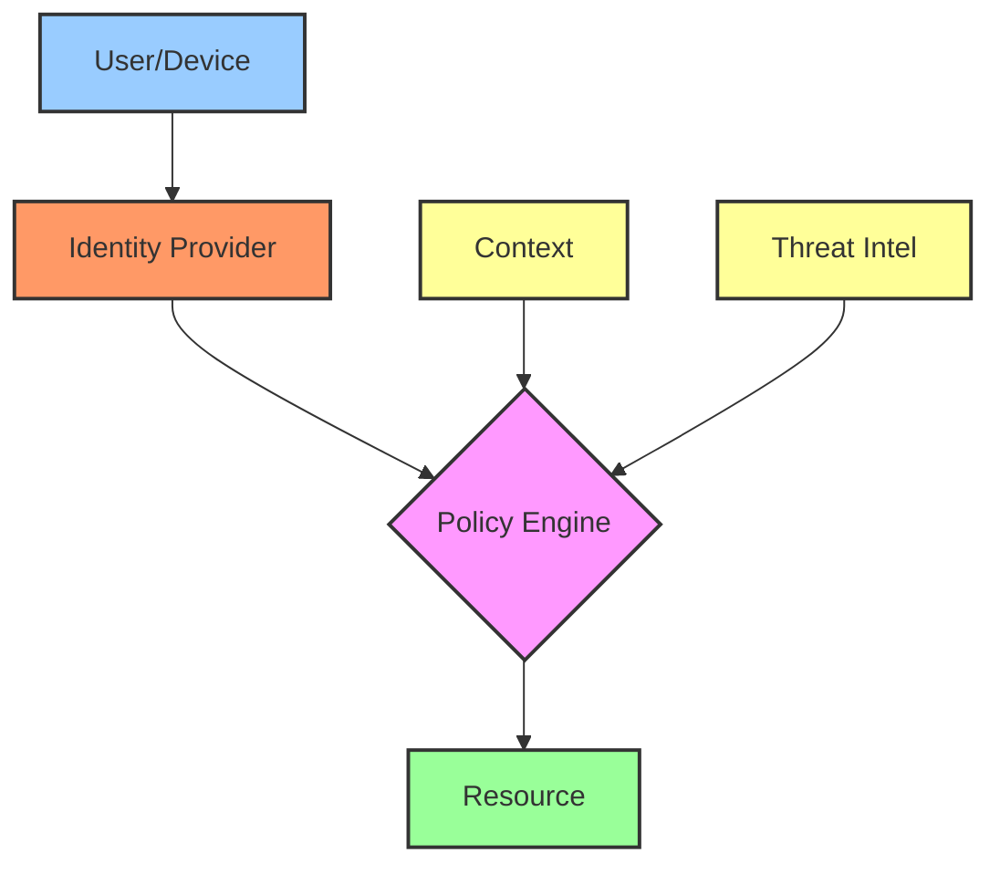

### Container Network Architecture


## Checklist for Network Design

### 1. Requirements Analysis
- [ ] Performance requirements
- [ ] Scalability needs
- [ ] Security requirements
- [ ] Compliance requirements
- [ ] Budget constraints

### 2. Architecture Design
- [ ] Network topology
- [ ] IP addressing scheme
- [ ] Security zones
- [ ] Redundancy plan
- [ ] Disaster recovery

### 3. Implementation Plan
- [ ] Hardware selection
- [ ] Software selection
- [ ] Configuration management
- [ ] Monitoring setup
- [ ] Documentation

### 4. Testing and Validation
- [ ] Performance testing
- [ ] Security testing
- [ ] Failover testing
- [ ] Load testing
- [ ] User acceptance testing

## Additional Resources

### Network Automation
1. Ansible Network Automation: https://docs.ansible.com/ansible/latest/network/
2. Terraform Network Providers: https://registry.terraform.io/browse/providers
3. Python Network Programming: https://github.com/ktbyers/netmiko

### Security Resources
1. OWASP Network Security Testing Guide: https://owasp.org/www-project-web-security-testing-guide/
2. Cloud Security Alliance: https://cloudsecurityalliance.org/
3. NIST Cybersecurity Framework: https://www.nist.gov/cyberframework

### Modern Networking
1. Service Mesh Hub: https://servicemesh.io/
2. Cloud Native Computing Foundation: https://www.cncf.io/
3. 5G Specifications: https://www.3gpp.org/specifications
