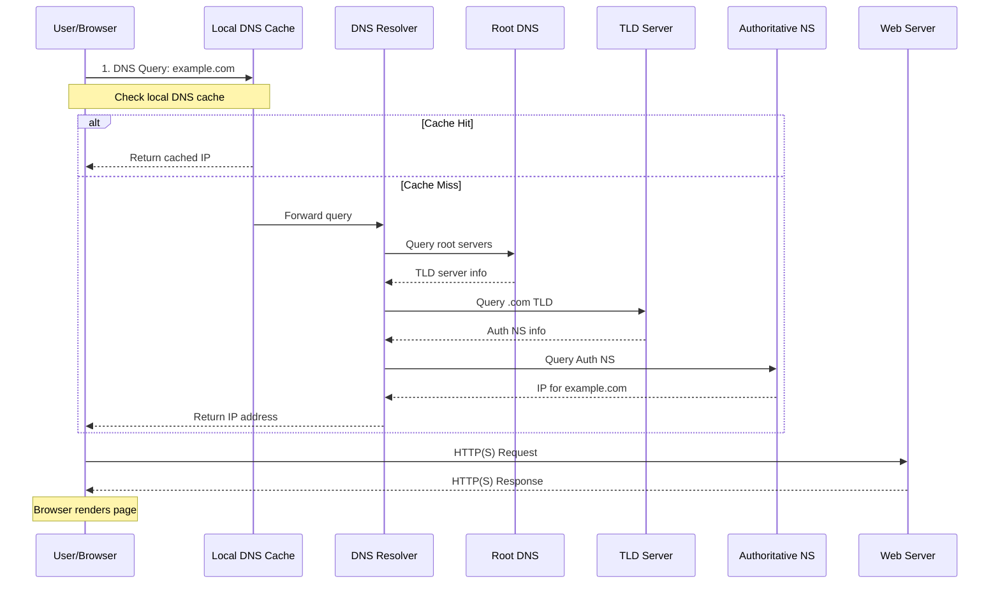

## How does a web page get rendered when you enter "example.com" on web browser?



1. **Initial Browser Request (URL Parsing)**
   When you enter a URL like "example.com" in the browser, it begins by parsing the URL into its fundamental components. The browser identifies the protocol, which defaults to HTTPS if not specified. It then extracts the domain name, which in this case would be "example.com". If no specific path is provided, the browser defaults to "/". The browser also processes any query parameters that follow a question mark and any fragment identifiers that come after a hash symbol in the URL.

2. **DNS Resolution Process**
   The Domain Name System (DNS) resolution process converts a human-readable domain name into an IP address through several steps:

   a) **Local DNS Cache Check**
      The resolution process begins with checking various local caches. First, the browser examines its internal DNS cache for recent lookups. If not found there, the operating system checks its own DNS cache. As a final local check, the system consults the hosts file (located at /etc/hosts on Unix systems), which can contain manual DNS entries.
   
   b) **Recursive DNS Resolution**
      If the IP address isn't found locally, the query is forwarded to a configured DNS resolver. Several popular public DNS resolvers are available, including Google Public DNS (8.8.8.8, 8.8.4.4), Cloudflare (1.1.1.1), and OpenDNS (208.67.222.222). These services handle the recursive resolution process on behalf of the client.
   
   c) **DNS Query Chain**
      The DNS resolution follows a hierarchical chain of servers. The process starts with Root DNS Servers, which direct queries to the appropriate Top-Level Domain Servers (like .com or .org). These TLD servers then point to the Authoritative Name Servers that hold the actual DNS records for the domain. Each step in this chain provides increasingly specific information about the domain's location.

3. **TCP/IP Connection Establishment**
   Once the browser obtains the IP address, it initiates a TCP connection with the server. For HTTPS connections, a TLS handshake follows a specific sequence: The client begins with a Client Hello message containing supported cipher suites, followed by the server's response with its chosen cipher suite. The server then presents its digital certificate, and both parties engage in a key exchange process. This results in a secure, encrypted connection between the client and server.

4. **HTTP Request Processing**
   The browser constructs and sends an HTTP request to the server. A typical request includes several important headers:
     ```http
     GET / HTTP/1.1
     Host: example.com
     User-Agent: Mozilla/5.0 ...
     Accept: text/html,application/xhtml+xml,...
     Accept-Language: en-US,en;q=0.9
     Connection: keep-alive
     ```
   The server receives this request and processes it according to its configuration and the requested resource.

5. **Server Response**
   The server processes the request and responds with an HTTP response that includes headers and the requested content:
     ```http
     HTTP/1.1 200 OK
     Content-Type: text/html
     Content-Length: 12345
     Cache-Control: max-age=3600
     
     <!DOCTYPE html>
     <html>...
     ```

6. **Browser Rendering Process**
   The browser's rendering engine follows a sophisticated process to convert the received HTML into a visible webpage. It begins with DOM construction, parsing the HTML document into a tree structure that represents the page's content. Simultaneously, it processes any CSS into the CSSOM (CSS Object Model), which defines the styling rules for the page. These two structures are combined into a render tree, which contains only the elements that will be visible on the page. The browser then calculates the exact position and size of each element in the layout phase, followed by the paint phase where it converts the render tree into actual pixels on the screen. Finally, the compositing phase manages different layers of the page for optimal display and scrolling performance.

7. **Post-Rendering Operations**
   After the initial page render, the browser continues with several important tasks. It executes JavaScript code that may modify the page's content or behavior. The browser loads additional assets such as images, videos, and other media files. It sets up event handlers to respond to user interactions, and may make additional API calls to fetch dynamic content. These operations continue throughout the page's lifecycle to maintain interactivity and update content as needed.

### DNS Resolvers

Internet service providers (ISPs): Many ISPs provide DNS resolution services to their customers as part of their internet service package. For example, Comcast, AT&T, and Verizon all offer DNS resolution services to their customers.

Public DNS resolvers: There are also many public DNS resolvers that can be used by anyone, regardless of their ISP. Some examples include Google Public DNS, Cloudflare DNS, and OpenDNS. These DNS resolvers are usually free to use and are often faster and more secure than the DNS resolution services provided by ISPs.

Corporate DNS resolvers: Large corporations often operate their own DNS resolvers for use by their employees. This can be more efficient and secure than relying on a public DNS resolver, as it allows the corporation to control the DNS resolution process and customize it to meet their specific needs.

It's worth noting that you can choose which DNS resolver you use on your computer or device. Many operating systems allow you to specify a preferred DNS resolver in the network settings. Alternatively, you can use a third-party DNS resolver such as those listed above by changing the DNS settings on your router.
